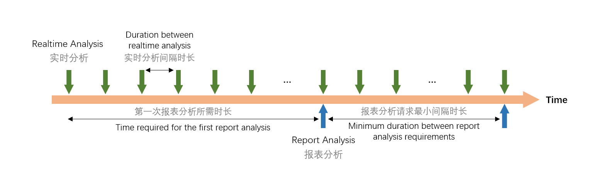
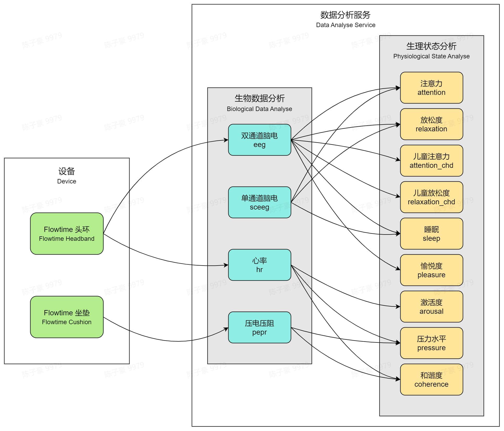

# 数据分析服务

## 数据分析方式 {#data-analysis-mode}

对于每一种数据分析服务，我们提供了两种形式的情感云返回的分析结果：**实时分析**和**报表分析**。

- 实时分析可以持续获得实时的生物数据和生理状态指标，让你的产品实时对用户的生理、情感状态做出响应，从而开发出与用户实时交互的产品。比如通过实时计算用户的注意力来控制小车的速度，或通过实时判断用户是否入睡来决定是否关闭助眠音乐等。
- 在经过一段时间的实时分析后可以选择进行报表分析。报表分析可以获得从会话开始到当前时刻的这段时间内的生物数据和生理状态指标趋势，让用户了解自己一段时间内的生理状态、情感情绪变化。比如通过睡眠曲线来反映用户的睡眠情况，或通过分析冥想用户的前后压力水平的变化来衡量冥想的减压效果等。
- 每种数据分析服务的实时分析结果和报表分析结果具体内容请参考[情感云数据分析服务总览](#)。

## 数据分析服务依赖关系 {#dependencies-of-data-analysis-service}

### 生物数据分析和生理状态分析

- 情感云数据分析服务分为**生物数据分析**和**生理状态分析**两种类型。
- 生物数据分析可以从设备采集到的原始信号中提取相关的特征，为你的产品提供一些客观、专业的生物数据展示，如脑电波节律能量、心率、心率变异性等。
- 生理状态分析提供了不同维度的生理状态量化分析，让用户了解自己的生理状态、情绪情感等变化情况，如注意力、放松度、压力水平等。

:::caution

当订阅某一项生理状态分析服务时，必须同时订阅其依赖的生物数据分析服务。

:::

### 设备支持的数据分析服务

不同设备支持的数据分析服务不同。具体可以查看不同设备页面的介绍：

- [Flowtime 头环支持的数据分析服务](../devices/flowtime-headband#data-analysis-service)
- [Flowtime 坐垫支持的数据分析服务](../devices/flowtime-cushion#data-analysis-service)

### 依赖关系总览 {#dependencies-overview}

## 数据分析服务总览 {#data-analysis-service-overview}

| 服务类型 | 服务名称 | 实时分析结果 | 报表分析结果 | 支持设备 |
|---|---|---|---|---|
| 生物数据分析 | 双通道脑电波（eeg） | 实时脑电波波形 α/β/θ/δ/γ波能量占比 脑电信号质量 | α/β/θ/δ/γ波能量占比全程记录 脑电信号质量全程记录 | Flowtime 头环 |
|  | 单通道脑电波（sceeg）***Beta*** |  |  |  |
|  | 心率（hr） | 实时心率 实时 HRV | 心率平均值 心率最大值 心率最小值 心率全程记录 HRV 平均值 HRV 全程记录 | Flowtime 头环 |
|  | 压电压阻（pepr）***Beta*** | 实时脉搏波波形 实时心率 实时 HRV 实时呼吸波波形 实时呼吸率 脉搏波信号质量 呼吸波信号质量 | 心率平均值 心率最大值 心率最小值 心率全程记录 HRV 平均值 HRV 全程记录 呼吸率平均值 呼吸率全程记录 | Flowtime 坐垫 |
| 生理状态分析 | 注意力（attention） | 实时注意力 | 注意力平均值 注意力全程记录 | Flowtime 头环 |
|  | 放松度（relaxation） | 实时放松度 | 放松度平均值 放松度全程记录 | Flowtime 头环 |
|  | 压力水平（pressure） | 实时压力水平 | 压力水平平均值 压力水平全程记录 | Flowtime 头环 Flowtime 坐垫 |
|  | 愉悦度（pleasure）***Beta*** | 实时愉悦度 | 愉悦度平均值 愉悦度全程记录 | Flowtime 头环 |
|  | 激活度（arousal）***Beta*** | 实时激活度 | 激活度平均值 激活度全程记录 | Flowtime 头环 |
|  | 和谐度（coherence） | 实时和谐度 | 和谐度平均值 和谐度全程记录 和谐区间标记 和谐时长 | Flowtime 头环 Flowtime 坐垫 |
|  | 睡眠（sleep） | 入睡判断 睡眠程度 睡眠分期 | 全程睡眠曲线 全程睡眠分期 入睡点 各睡眠状态时长统计 | Flowtime 头环 |
|  | 儿童注意力（attention_chd）***Beta*** | 实时注意力 | 注意力平均值 注意力全程记录 | Flowtime 头环 |
|  | 儿童放松度（relaxation_chd）***Beta*** | 实时放松度 | 放松度平均值 放松度全程记录 | Flowtime 头环 |

:::info

标注 ***Beta*** 的服务是测试版，仍可提供计算服务，但准确性待进一步测试。

:::
