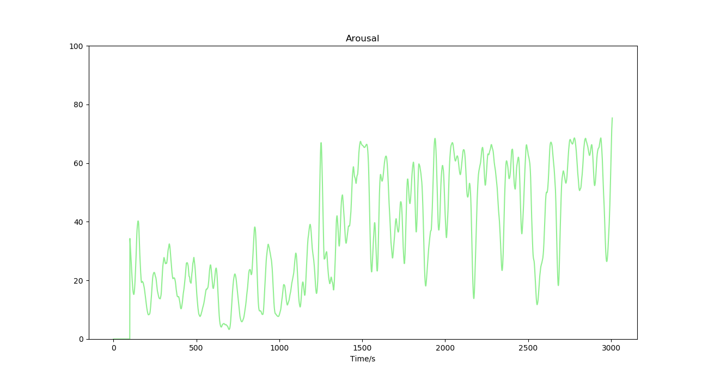
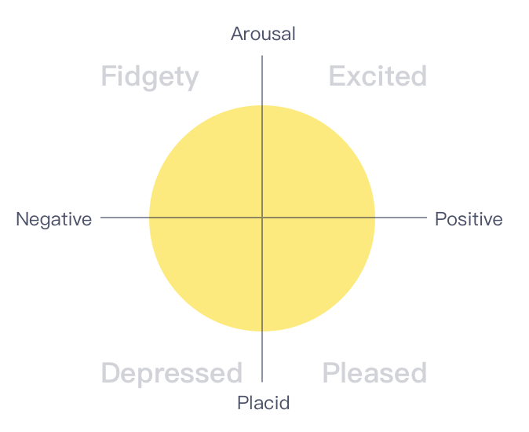
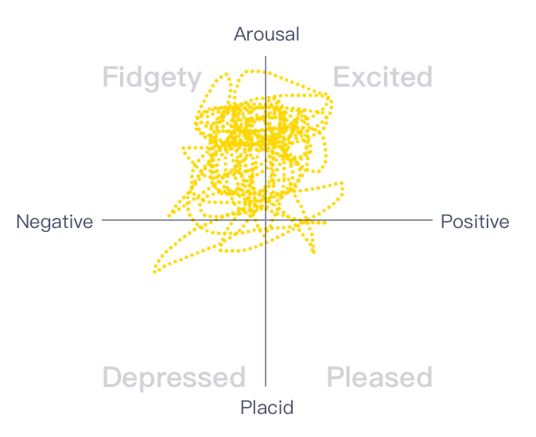
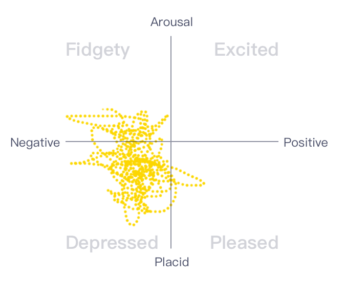
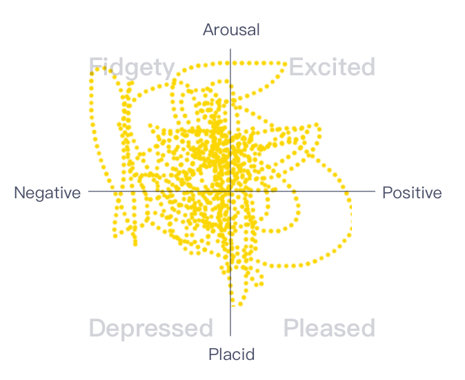

# 激活度（Arousal）*Beta*

## 名词解释

自主神经系统（ANS）与情绪、生理活动相关，当情绪激动时，生理唤醒水平和身体器官激活程度将提高[^1][^2]。心率变异性的频域信息可以反映自主神经系统的变化[^3]。

激活度监测算法通过分析心率变异性等指标来评价情绪的激活水平。激活度的值越高表明越亢奋，值越低表明越平静。

保持稳定平静的情绪有利于健康。在入睡过程中，较高的激活度可能造成失眠[^4]。

:::info
由于激活度监测模块需要采集一些较长时间的生理指标，因此实时的压力水平可能需要较长时间（1分钟以上）才能出现。运动可能会影响激活度的测量。
:::

## 最佳实践

:::tip
通过「最佳实践」，我们会提供一些我们已经实践过的应用场景供你参考，通过这些例子你可以了解如何将我们提供的数据和你的应用场景结合。
:::

### 激活度在冥想中的应用

激活度的变化依赖于具体的冥想形式。冥想过程中，在进入某些状态后，激活度可能达到较高水平。可以通过激活度的变化来观察自己在冥想中的状态投入。经过长期训练的冥想人士在冥想过程中可以使身体进入较为兴奋的状态，但同时保持大脑的清醒放松。

#### 冥想过程中的激活度变化

冥想中进入某些状态后激活度上升到较高水平。

### 愉悦度与激活度（Pleasure & Arousal）

愉悦度监测模块与激活度监测模块结合能够更好地反映冥想过程中的情绪变化。愉悦度与激活度构成的四象限散点图可以反映集中基本情绪的倾向性。通过长期的冥想训练，可使情绪状态更加稳定，情绪散点图更加集中，且趋向于中性。

#### 情绪四象限图

#### 不同冥想状态下的情绪散点图

通过情绪散点图可以看出，三种不同的冥想状态中，情绪分布为：
- 中性
- 偏消极
- 波动较大

 |  | 
---|---|---

---

***参考文献***

[^1]: Levenson, Robert. (2014). The Autonomic Nervous System and Emotion. Emotion Review. 6. 100-112. 10.1177/1754073913512003.
[^2]: Benarroch, Eduardo. (2020). Physiology and Pathophysiology of the Autonomic Nervous System. Continuum (Minneapolis, Minn.). 26. 12-24. 10.1212/CON.0000000000000817.
[^3]: Zhu, Jianping & Ji, Lizhen & Liu, Chengyu. (2019). Heart rate variability monitoring for emotion and disorders of emotion. Physiological Measurement. 40. 10.1088/1361-6579/ab1887.
[^4]: Taibi, Diana. (2012). HEART RATE VARIABILITY AS A BIOMARKER OF AROUSAL in INSOMNIA.
