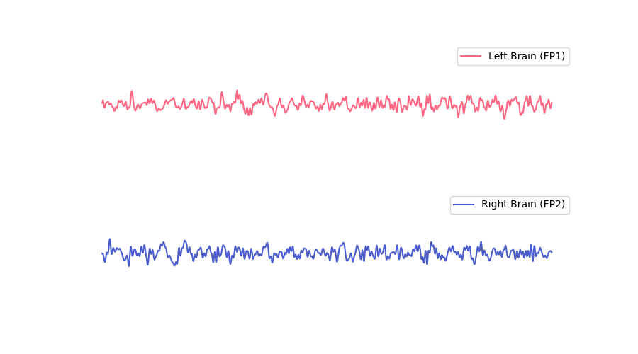
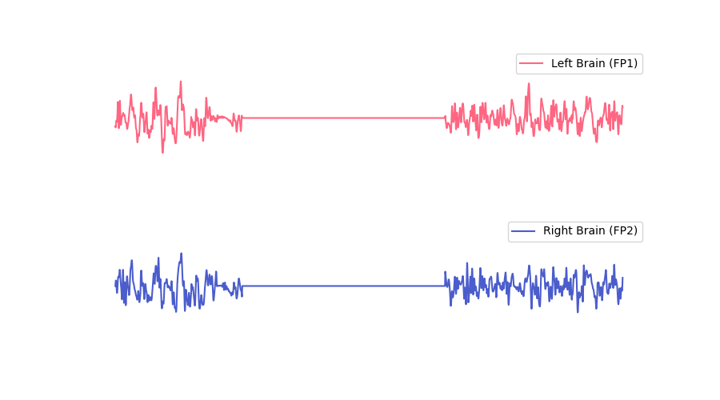
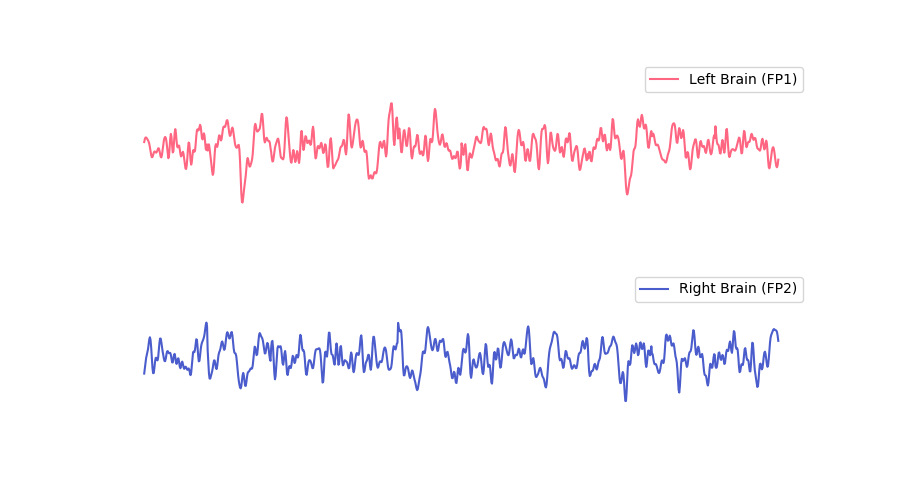
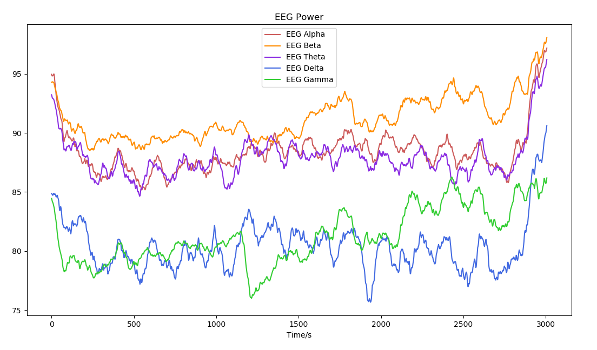
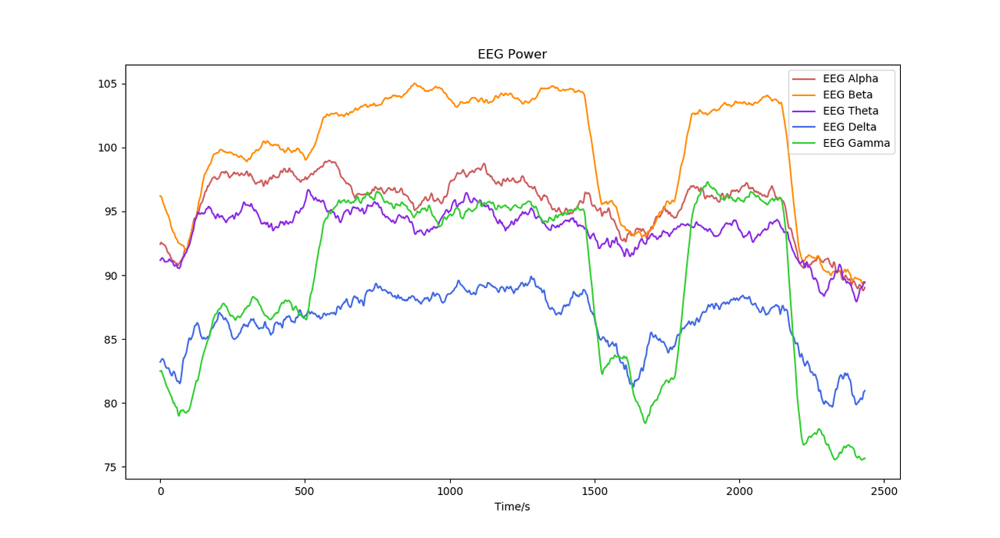

# 脑电波（EEG）

## 名词解释

### 脑电波（Brainwave）

脑电波是由大脑中大量神经细胞活动而产生的，在头皮表面可检测到这种微弱的电信号。脑电波的特征会随大脑状态而改变[^1]。

回车生物信号采集模块通过特殊的电极与芯片获取左前额与右前额的电信号，从中提取有效的脑电波。

未佩戴设备或未检测到有效脑电波时，脑电波显示为一条直线。佩戴设备后，电极材料存在一段极化过程（与皮肤状态有关，一般约为30s~1min，干燥的皮肤可能需要更长的极化时间），极化期间噪声较大，可能导致脑电波显示不稳定，待极化完成后显示稳定的脑电波形。

:::tip
为了获得更好的体验，实时脑电波保留了少量眼电信息，眨眼、眼动等小幅面部肌肉活动可在脑电波形上反映出来。咬牙等大幅面部肌肉活动可能对脑电信号造成过多干扰，导致无法检测到有效脑电波。
:::

#### 正常有效的脑电波波形

#### 未佩戴良好或受到干扰时的脑电波波形

#### 眨眼或者眼动情况下的脑电波波形

### 脑电波节律（Brainwave Rhythms）

脑电波按频段可分为常见的5种节律：α 波、β 波、θ 波、δ 波、γ 波，分别对应不同的大脑状态[^1]。对脑电波进行频域分析，可以得到5种脑电波节律的能量比例。脑电波各个节律的强弱变化可以反映大脑活动状态的变化。

| 脑电波节律 | 频段 | 状态说明 |
| :---: | :---: | :---: |
| γ 波 | 30~45 Hz | 觉醒且非常专注 |
| β 波 | 14~28 Hz | 专注、亢奋、紧张 |
| α 波 | 8~13 Hz | 清醒、放松、闭眼 |
| θ 波 | 4~7 Hz | 非常放松、浅睡 |
| δ 波 | 0.5~4 Hz | 深睡 |

:::info
不同资料上显示的脑电波节律频段数值上有微小出入，本算法中频段选取参考文献[^1]。
:::

脑电波节律能量比例不仅受大脑状态影响，还与性别、年龄等因素相关[^2][^3][^4]，不同人在不同状态下的脑电波节律可能存在差异。

脑电波节律能量可以表示为绝对值（单位为 dB）或相对值（比例）。这里提供一种使用回车脑电采集设备获得的典型脑电波节律能量作为参考：β 波较多（80~100 dB，30~40%），其次是 θ 波和 α 波（80~90 dB，20~30%），γ 波中等（70~85 dB，10~15%），δ 波很少（65~80 dB，10% 以下）。（被试者为男性，28岁，数据在睁眼清醒状态下测得）

:::info
采集到的脑电波各节律能量比例与采集位点、设备幅频特性等相关，使用回车脑电采集设备获得的脑电波节律能量比例与其他设备可能存在差异。
:::

## 最佳实践

:::tip
通过「最佳实践」，我们会提供一些我们已经实践过的应用场景供你参考，通过这些例子你可以了解如何将我们提供的数据和你的应用场景结合。
:::

### 脑电波频段能量在冥想场景中的应用

脑电波频段能量占比的变化趋势体现了冥想过程中精神状态的变化。

| 名称 | 冥想状态 |
| :---: | :---: |
| γ 波 | 资深经验的冥想人士在冥想过程中该频段可能出现较高能量 |
| β 波 | 冥想过程中，在专注度较高时该频段能量较高 |
| α 波 | 冥想过程中，由于闭眼和放松，该频段能量会比平时有所增加 |
| θ 波 | 具有一定冥想经验的人在冥想过程中可以出现较高的θ波，但同时又保持清醒 |
| δ 波 | 冥想过程中一般没有太大变化 |

#### 典型冥想状态下的脑电波节律（dB）

该被试3年冥想经验；随着进入冥想状态，β 波和 γ 波能量呈现上升趋势

#### 某种冥想状态下的脑电波节律（dB）

该用户具有多年冥想经验；在冥想过程中出现两段明显不同的状态，在该状态下 β 波和 γ 波能量明显上升

---

***参考文献***

[^1]: Sanei, Saeid & Chambers, Jonathon. (2007). EEG signal processing. 10.1002/9780470511923.
[^2]: Doppelmayr, Michael. (2004). Changes in EEG-bandpower and coherence in the theta, alpha, and gamma band while solving Raven's Matrices. International Journal of Psychophysiology. 54. 38-38.
[^3]: Otero GA, Pliego-Rivero FB, Fernández T, Ricardo J (2003) EEG development in children with sociocultural disadvantages: a follow-up study. Clin Neurophysiol 114:1918–1925.
[^4]: Latta F, Leproult R, Tasali E, Hofmann E, Van Cauter E (2005) Sex differences in delta and alpha EEG activities in healthy older adults. Sleep 28:1525–1534.
