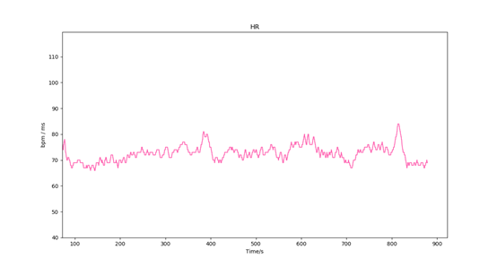
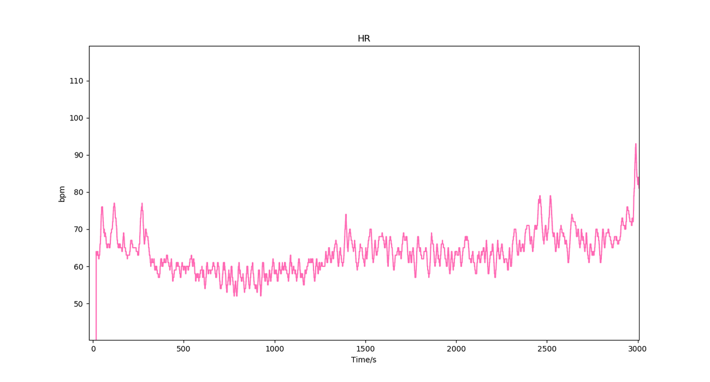
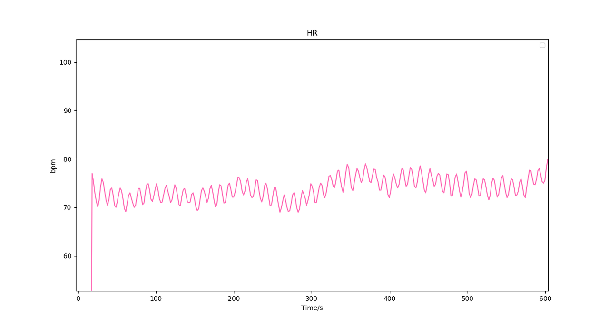
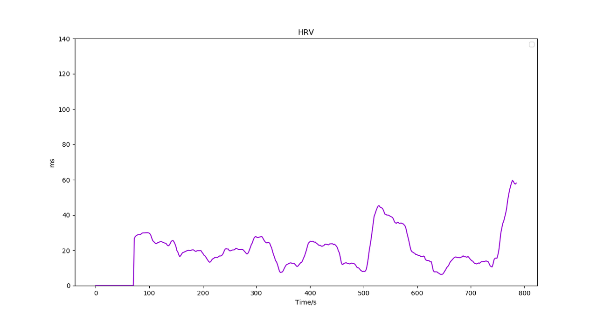
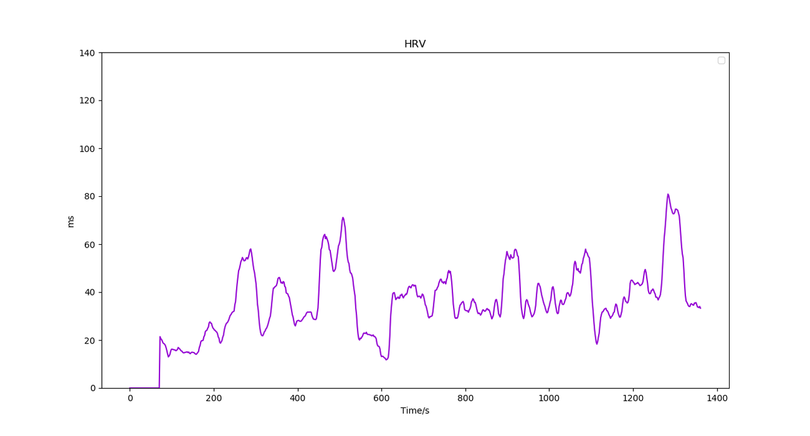

# 心率（HR）

## 名词解释

### 心率（HR） {#hr}

心率是指单位时间内心跳的次数，通常以1分钟的心跳次数来表示（单位为BPM）[^1]，正常人的静息心率一般在50-90 BPM[^2]。在一些实际场景中，为了获得实时的心跳变化，会以更短的时间来计算心率[^3]。

回车生物信号采集模块通过光电容积脉搏波传感器（PPG）测量得到，皮肤与设备接触良好时可以获得准确的实时心率值。

### 心率变异性（HRV） {#hrv}

心率变异性表示心跳间隔时间的变化, 可以提供丰富的生理与病理信息，是一种可靠的医学指标[^4][^5]。心率变异性的值越大表明心率变化越快，值越小表明心率变化越小。

心率变异性与自主神经系统（ANS）相关。非运动状态下，较高的 HRV 表明身体系统对环境变化有良好的适应性，而在压力、焦虑等情况下，心率变异性会降低[^4]。通过有规律的深呼吸可以使心率与心率变异性呈现周期性变化，并提高心率变异性水平[^6]。

:::info
医学上采用 24 小时时域分析的 SDNN（心跳 N-N 间期标准差）作为 HRV 分析指标。近年来也有许多研究提出采用超短期 HRV（1min）可以实时有效地评估精神压力[^7]。本算法基于具体应用场景，采用短时间内（1min）的 SDNN 分析 HRV，可以更实时地反映心跳变化情况以及计算压力等数据。
:::

## 最佳实践

:::tip
通过「最佳实践」，我们会提供一些我们已经实践过的应用场景供你参考，通过这些例子你可以了解如何将我们提供的数据和你的应用场景结合。
:::

### 心率在冥想应用场景下的实践

心率与身体状态密切相关。在冥想过程中，心率的变化可能与冥想方法有关。在不同冥想方法下，心率可能表现为降低、升高或平稳的趋势。一般状态下心率的变化呈现无序性，通过放松练习和有规律的深呼吸可以使心率呈现一定的周期性节律，达到心-脑和谐的状态。

#### 典型冥想心率变化曲线

#### 冥想时心率呈现平稳的趋势

#### 冥想时心率呈现下降和升高的趋势

#### 冥想时心率呈现周期性节律

### HRV 在冥想应用场景下的实践

HRV的水平因人而异，每个人的基础HRV水平是不同的。而在冥想过程中，HRV水平随冥想状态的改变可能有所变化。一般在放松和有规律的深呼吸状态下，HRV水平将有所上升。有经验的冥想人士可以在这种状态下维持更长时间。通过长期的放松练习，可提高HRV的整体水平。

#### 典型冥想状态下的HRV变化曲线

#### 冥想时进入状态后HRV升高并维持在较高状态

该被试为5年冥想经验

---

***参考文献***

[^1]: Ananya Mandal. What is Heart Rate? News-medical.(2019-06-05). https://www.news-medical.net/health/What-is-Heart-Rate.aspx
[^2]: Nanchen, David. (2018). Resting heart rate: What is normal?. Heart. 104. heartjnl-2017. 10.1136/heartjnl-2017-312731.
[^3]: Block, Frank. (1994). What is heart rate, anyway?. Journal of clinical monitoring. 10. 366-70. 10.1007/BF01618415.
[^4]: Walters, S. (2015). Heart rate variability (HRV): Prognostic significance, risk factors and clinical applications.
[^5]: Shashikant, R. & Chetankumar, P.. (2020). A Review on Impact Application of Heart Rate Variability (HRV). 10.1007/978-3-030-24322-7_1.
[^6]: McCraty, Rollin. (2006). Emotional Stress, Positive Emotions and Psychophysiological Coherence.
