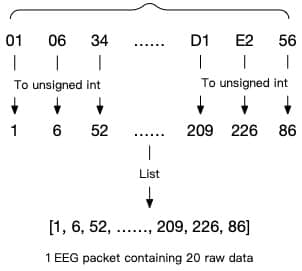

# 生物数据分析服务协议

在创建会话之后，你可以在会话中与情感云平台进行数据交互。生理状态分析服务依赖于生物数据分析服务（具体依赖关系请参考[数据分析服务依赖关系](../data-analysis-service#dependencies-of-data-analysis-service)），因此需要先初始化生物数据分析服务并上传生物信号数据，才能使用生理状态分析服务。

针对生物数据分析服务的操作如下：

| 服务 | 操作 | 说明 |
| --- | --- | --- |
| biodata | init | 启动并初始化生物数据分析服务 |
|  | subscribe | 订阅生物数据实时分析 |
|  | unsubscribe | 取消订阅生物数据实时分析 |
|  | upload | 上传生物信号数据 |
|  | report | 获取生物数据报表分析 |

## 启动并初始化生物数据分析服务（biodata init）{#biodata-init}

### biodata init 的 Request

biodata init 的 Request 结构体如下：

```python
{
    "services": "biodata",
    "op": "init",
    "kwargs": {
        "bio_data_type": [  # 需要初始化的基础生物数据分析服务（详见下文）
            bio_data_type1,  # 基础生物数据服务类型，eeg、hr 等
            bio_data_typeN
        ],
        "algorithm_params": {  # 可选服务名称
            bio_data_type1: {  # 基础生物数据分析服务 1 的可选配置（详见下文）
            },
            bio_data_typeN: {  # 基础生物数据分析服务 N 的可选配置（详见下文）
            }
        },
    }
}
```

在`bio_data_type`中传入需要启动的生物数据分析服务的名称，并在`algorithm_params`中传入这些服务对应的可选配置参数，便可以对这些服务进行初始化配置以满足个性化需求。你也可以选择不进行配置，情感云将会使用默认配置进行分析。

目前`algorithm_params`可支持的配置参数如下：

| 参数 | 服务名称 | 配置项 | 配置内容 | 说明 |
| --- | --- | --- | --- | --- |
| algorithm_params | eeg | tolerance | 0~4<br/>默认值：2 | 脑电检测容差：脑电信号分析时对信号质量判断的容许程度<br/>该值越大，对佩戴情况的要求越低，在受到干扰时输出数据的概率较高，但其中包含噪声的概率也较高<br/>该值越小，对佩戴情况的要求越高，在受到干扰时可能无法输出数据，但输出的数据中包含噪声的概率较小 |
|  |  | channel_power_verbose | True/False<br/>默认值：False | 各通道能量详情：是否输出每个通道的脑电能量<br/>False：实时分析和报表分析的返回结果中只包含综合脑电能量<br/>True：实时分析和报表分析的返回结果中除了综合脑电能量之外，还包含每个通道的脑电能量 |
|  |  | power_mode | rate/db<br/>默认值：rate | 脑电节律能量输出形式<br/>rate：输出脑电节律能量相对占比，关注不同脑波之间的关系<br/>db：输出脑电节律绝对能量分贝值，关注单一脑波的变化趋势 |
|  |  | filter_mode | smart/basic<br/>默认值：smart | 脑电滤波模式<br/>smart：智能滤波，自动识别并过滤可能的噪声，降低噪声带来的影响，适合多数应用场景<br/>basic：滤波，只进行基本的漂移去除和带通滤波，包含更多信息和噪声 |

<details>
<summary>示例</summary>

```python
{
    "services": "biodata",
    "op": "init",
    "kwargs": {
        "bio_data_type": [ 
            "eeg", "hr"
        ],
        "algorithm_params": {
            "eeg": {
                "tolerance": 2,
                "channel_power_verbose": True
            }
        },
    }
}
```
</details>

### biodata init 的 Response

biodata init 的 Response 结构体如下：

```python
{
    "code": 0,
    "request": {
        "services": "biodata",
        "op": "init"
    },
    "data": {
        "bio_data_type": [  # 已经初始化的基础生物数据分析服务类型
            bio_data_type1,
            bio_data_typeN
        ]
    }
}
```

## 订阅生物数据实时分析（biodata subscribe）

订阅生物数据分析服务的实时分析数据。分析返回值为可选服务，如果你需要实时接收情感云分析的返回值，则开启此订阅。实时分析返回值请参考[生物数据实时分析返回值](../../data/data-format/biological-data#biological-data-realtime-analysis-returns)。

一些返回值依赖于初始化配置，初始化配置详情请参考[启动并初始化生物数据分析服务](#biodata-init)。

### biodata subscribe 的 Request

biodata subscribe 的 Request 结构体如下：

```python
{
    "services": "biodata",
    "op": "subscribe",
    "args": [biodata_type1, biodata_type2]  # 基础生物数据分析服务类型，eeg、hr等
}
```

<details>
<summary>示例</summary>

```python
{
    "services": "biodata",
    "op": "subscribe",
    "args": [biodata_type1, biodata_type2]  # 基础生物数据分析服务类型，eeg、hr等
}
```
</details>

### biodata subscribe 的 Response

:::caution
- biodata subscribe 有两种 Response
  - 订阅成功 Response
  - 订阅数据 Response
:::

#### 订阅状态 Response

返回所有正在订阅中的数据分析服务。

```python
{
    "code": 0,
    "request": {
        "services": "biodata",
        "op": "subscribe"
    },
    "data": {
        "sub_" + bio_data_type1 + "_fields": [  # bio_data_type1: 基础生物数据分析服务类型，eeg、hr等
            data_type1, data_typeN  # 详见上文【基础生物数据实时分析返回值】“参数”列
        ],
        "sub_" + bio_data_typeN + "_fields": [
            data_type1, data_typeN,
        ]
    }
}
```

#### 订阅数据 Response

返回的数据取决于 Subscribe 时设置的数据。

```python
{
    "code": 0,
    "request": {
        "services": "biodata",
        "op": "subscribe"
    },
    "data": {
        bio_data_type1: {  # 生物数据类型，eeg、hr等
            data_type1: data1,    # 分析结果（详见上文【基础生物数据实时分析返回值】）
            data_typeN: dataN,
        },
        bio_data_typeN: {
            data_type1: data1,
            data_typeN: dataN,
        }
    }
}
```

## 取消订阅生物数据实时分析（biodata unsubscribe）

取消生物数据分析服务实时分析数据的订阅。

### biodata unsubscribe 的 Request

biodata unsubscribe 的 Request 结构体如下：

```python
{
    "services": "biodata",
    "op": "unsubscribe",
    "args": [biodata_type1, biodata_type2]
}
```

<details>
<summary>示例</summary>

```python
{
    "services": "biodata",
    "op": "unsubscribe",
    "args": ["eeg"]
}
```
</details>

### biodata unsubscribe 的 Response

biodata unsubscribe 的 Response 结构体如下：

```python
{
    "code": 0,
    "request": {
        "services": "biodata",
        "op": "unsubscribe"
    },
    "data": {
        "sub_" + bio_data_type1 + "_fields": [ # bio_data_type1: 正在订阅的基础生物数据分析服务类型，eeg、hr等
            data_type1, data_typeN
        ],
        "sub_" + bio_data_typeN + "_fields": [
            data_type1, data_typeN,
        ]
    }
}
```

## 上传生物信号数据（biodata upload）

客户端上传生物信号数据。客户端需将从硬件设备接收到的原始数据包进行拼接，满足一定的包数量之后上传。拼接的包数量需与上传周期倍数匹配，具体请参考[上传周期倍数（upload_cycle）](./session-protocol#upload-cycle)。

例如：设置上传周期倍数为 3，客户端需要每次从硬件设备接收到 150 个 EEG 数据包和 9 个 HR 数据包并上传情感云。

### biodata upload 的 Request

biodata upload 的 Request 结构体如下：

```python
{
    "services": "biodata",
    "op": "upload",
    "kwargs": {
        bio_data_type1: data, # bio_data_type1: 基础生物数据分析服务类型，eeg、hr等; data: 拼接后的生物数据包（详见下文【生物信号数据上传处理】）
        bio_data_typeN: dataN
    }
}
```

<details>
<summary>示例</summary>

```python
{
    "services": "biodata",
    "op": "upload",
    "kwargs": {
        "eeg": [126, 45, 24, 67 ... 34, 154, 200, 123, 875]
    }
}
```
</details>

### biodata unsubscribe 的 Response

biodata unsubscribe 的 Response 结构体如下：

```python
{
    "code": 0,
    "request": {
        "services": "biodata",
        "op": "unsubscribe"
    },
    "data": {
        "sub_" + bio_data_type1 + "_fields": [ # bio_data_type1: 正在订阅的基础生物数据分析服务类型，eeg、hr等
            data_type1, data_typeN
        ],
        "sub_" + bio_data_typeN + "_fields": [
            data_type1, data_typeN,
        ]
    }
}
```

### 生物信号数据上传处理

客户端从硬件设备接收到的生物信号数据需处理为十进制无符号整型之后，再拼接并上传。此处以双通道脑电波数据和心率数据为例进行说明。

<details>
<summary>双通道脑电波数据转换示例</summary>



- 将双通道脑电波数据包内的字节数据按照顺序转换为十进制无符号整型
- 将转换后的数据保存为列表
- 每一个转换后的列表包含 20 个数据
- 按照设定的 `upload_cycle` ，将转换后的 50 * `upload_cycle` 个数据包拼接成一个列表，然后上传情感云（详细规则请参考[上传周期倍数（upload_cycle）](./session-protocol#upload-cycle)）

</details>

<details>
<summary>心率数据转换示例</summary>


- 将心率数据包内的字节数据转换为十进制无符号整型
- 按照设定的 `upload_cycle` ，将转换后的 3 * `upload_cycle` 个数据包拼接成一个列表，然后上传情感云（详细规则请参考[上传周期倍数（upload_cycle）](./session-protocol#upload-cycle)）

</details>

## 获取生物数据报表分析（biodata report）

获取生物数据分析统计报表。可以获得从会话开始到当前时刻的这段时间内的报表分析。报表分析返回值请参考[生物数据报表分析返回值](../../data/data-format/biological-data#biological-data-report-analysis-returns)。


:::caution
- 第一次请求报表分析需要一定的时长。具体来说，会话过程中或结束时若已经接收到（subscribe） 达到规定次数，则可请求报表分析，否则返回值为空或 0。
- 两次请求报表分析之间需间隔一定的时长。具体来说，每次请求报表分析的结果会缓存一定时间，在这段时间内请求的报表分析都为上一次的结果。当距离上一次请求报表分析的时长大于规定间隔时长之后，再次请求则会返回新的报表分析结果。
:::

| 服务 | 需要收到 subscribe 次数 | 报表分析请求间隔时长 |
| --- | --- | --- |
| eeg | 20 | 2 min |
| hr | 20 | 2 min |
| sceeg | 20 | 2 min |
| pepr | 20 | 2 min |

### biodata report 的 Request

biodata report 的 Request 结构体如下：

```python
{
    "services": "biodata",
    "op": "report",
    "kwargs": {
        "bio_data_type": [
            bio_data_type1,   # 基础生物数据分析服务类型，eeg、hr等
            bio_data_typeN
        ]
    }
}
```

<details>
<summary>示例</summary>

```python
{
    "services": "biodata",
    "op": "report",
    "kwargs": {
        "bio_data_type": [
            "eeg"
        ]
    }
}
```
</details>

### biodata report 的 Response

biodata report 的 Response 结构体如下：

```python
{
    "code": 0,
    "request": {
        "services": "biodata",
        "op": "report"
    },
    "data": {
        bio_data_type1: {  # 基础生物数据分析服务类型，eeg、hr等
            data_type1: data1,  # 分析结果（详见上文【基础生物数据报表分析返回值】）
            data_typeN: dataN,
        },
        bio_data_typeN: {
            data_type1: data1,
            data_typeN: dataN,
        }
    }
}
```
