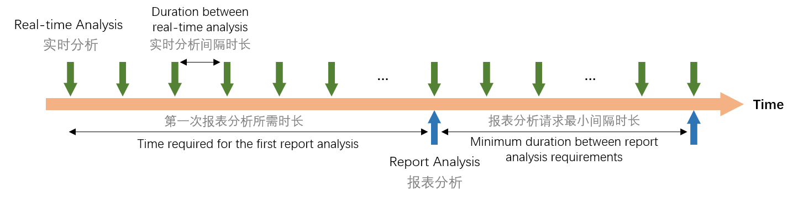

# 生理状态分析服务协议

生理状态分析服务依赖于生物数据分析服务（具体依赖关系请参考[数据分析服务依赖关系](../data-analysis-service#dependencies-of-data-analysis-service)）。在初始化生物数据分析服务之后（具体请参考[生物数据分析服务协议](./biological-data-analysis-service-protocol)），才能使用生理状态分析服务。

一般情况下，每次上传生物信号数据可触发一次相应的生物数据实时分析，并同时触发一次依赖于该生物信号数据的生理状态实时分析（睡眠服务除外）。
订阅睡眠服务，则最小上传周期倍数为 10，如果设置上传周期倍数小于 10，则只改变生物数据实时分析的间隔时长，而睡眠计算的间隔时长仍然按照上传周期倍数为 10 的情况（即间隔时间为 6 秒）触发。
针对生理状态分析服务的操作如下：

在创建会话之后，你可以在会话中与情感云平台进行数据交互。生理状态分析服务依赖于生物数据分析服务，因此需要先初始化生物数据分析服务并上传生物信号数据，才能使用生理状态分析服务。

针对生物数据分析服务的操作如下：

| 服务 | 操作 | 说明 |
| --- | --- | --- |
| affective | start | 启动并初始化生物数据分析服务 |
|  | subscribe | 订阅生理状态分析实时分析 |
|  | unsubscribe | 取消订阅生理状态分析实时分析 |
|  | report | 获取生理状态分析报表分析 |
|  | finish | 结束数据分析服务 |

## 启动并初始化生理状态分析服务（affective start） {#affective-start}

### affective start 的 Request

affective start 的 Request 结构体如下：

```python
{
    "services": "affective",
    "op": "start",
    "kwargs": {
        "cloud_services": [
            cloud_service1, # 生理状态分析服务类型，attention、relaxation、pressure等
            cloud_serviceN
        ],
        "algorithm_params": {  # 可选参数
            cloud_services1: {  # 生理状态分析服务 1 的可选配置参数（详见下文）
            },
            cloud_servicesN: {  # 生理状态分析服务 N 的可选配置参数（详见下文）
            }
        },
    }
}
```

在`cloud_services`中传入需要启动的生理状态分析服务的名称，并在`algorithm_params`中传入这些服务对应的可选配置参数，便可以对这些服务进行初始化配置以满足个性化需求。你也可以选择不进行配置，情感云将会使用默认配置进行分析。

目前`algorithm_params`可支持的配置参数如下：

| 参数 | 服务名称 | 配置项 | 配置内容 | 说明 |
| --- | --- | --- | --- | --- |
| algorithm_params | sleep | sleep_stage_output | True/False<br/>默认值：False | 睡眠分期输出：是否计算睡眠分期（快速眼动期时长计算依赖于睡眠分期计算）<br/>False：实时分析和报表分析的返回结果中不包括睡眠分期和快速眼动期时长<br/>True：实时分析和报表分析的返回结果中包括睡眠分期和快速眼动期时长 |

<details>
<summary>示例</summary>

```python
{
    "services": "affective",
    "op": "start",
    "kwargs": {
        "cloud_services": [
            "attention",
            "sleep"
        ],
        "algorithm_params": {
            "sleep": {
                "sleep_stage_output": True
            }
        },
    }
}
```
</details>

### affective start 的 Response

affective start 的 Response 结构体如下：

```python
{
    "code": 0,
    "request": {
        "services": "affective",
        "op": "start"
    },
    "data": {
        "cloud_service": [
            cloud_service1, # 已启动的生理状态分析服务类型
            cloud_serviceN
        ]
    }
}
```

## 订阅生物数据实时分析（biodata subscribe）

订阅生理状态分析服务的实时分析数据。分析返回值为可选服务，如果你需要实时接收情感云分析的返回值，则开启此订阅。实时分析返回值请参考[生理状态实时分析返回值](./)。

一些返回值依赖于初始化配置，初始化配置详情请参考[启动并初始化生理状态分析服务](#affective-start)。

### affective subscribe 的 Request

affective subscribe 的 Request 结构体如下：

```python
{
    "services": "affective",
    "op": "subscribe",
    "args": [affective_service_type1, affective_service_type2]  # 生理状态分析服务类型
}
```

<details>
<summary>示例</summary>

```python
{
    "services": "affective",
    "op": "subscribe",
    "args": ["attention", "sleep"]
}
```
</details>

### affective subscribe 的 Response

:::caution
- affective subscribe 有两种 Response
  - 订阅成功 Response
  - 订阅数据 Response
- 服务需要在后台开通相关权限才可访问
:::

#### 订阅状态 Response

返回所有正在订阅中的数据分析服务。

```python
{
    "code": 0,
    "request": {
        "services": "affective",
        "op": "subscribe"
    },
    "data": {
        "sub_" + cloud_service1 + "_fields": [   # cloud_service1: 云计算服务类型，attention、relaxation、pressure等
            data_type1, data_typeN,  # 已订阅数据（详见上文【生理状态实时分析返回值】“参数”列）
        ]
        "sub_" + cloud_serviceN + "_fields": [
            data_type1, data_typeN,
        ]
    }
}
```

#### 订阅数据 Response

返回的数据取决于 Subscribe 时设置的数据。

```python
{
    "code": 0,
    "request": {
        "services": "affective",
        "op": "subscribe"
    },
    "data": {
            cloud_service1: {   # 生理状态分析服务数据类型，attention、relaxation、pressure等
                data_type1: data1,  # 数据类型、数据包（详见上文【生理状态实时分析返回值】）
                data_typeN: dataN,
            },
            cloud_serviceN: {
                data_type1: data1,
                data_typeN: dataN,
            }
        }
    }
}
```

## 取消订阅生理状态分析实时分析（affective unsubscribe）

取消生理状态分析服务实时分析数据的订阅。

### affective unsubscribe 的 Request

affective unsubscribe 的 Request 结构体如下：

```python
{
    "services": "affective",
    "op": "unsubscribe",
    "args": [affective_service_type]
}
```

<details>
<summary>示例</summary>

```python
{
    "services": "affective",
    "op": "unsubscribe",
    "args": ["attention"]
}
```
</details>

### affective unsubscribe 的 Response

affective unsubscribe 的 Response 结构体如下：

```python
{
    "code": 0,
    "request": {
        "services": "affective",
        "op": "unsubscribe"
    },
    "data": {
        "sub_" + cloud_service1 + "_fields": [   # cloud_service1: 生理状态分析服务数据类型，attention、relaxation、pressure等
            data_type1, data_typeN,  # 已订阅数据（详见上文【生理状态实时分析返回值】“参数”列）
        ]
        "sub_" + cloud_serviceN + "_fields": [
            data_type1, data_typeN,
        ]
    }
}
```

## 获取生理状态报表分析（affective report）

获取生理状态分析统计报表。可以获得从会话开始到当前时刻的这段时间内的报表分析。报表分析返回值请参考[生理状态报表分析返回值](./链接到数据-数据分析结果)。



:::caution
- 第一次请求报表分析需要一定的时长。具体来说，会话过程中或结束时若已经接收到（subscribe） 达到规定次数，则可请求报表分析，否则返回值为空或 0。
- 两次请求报表分析之间需间隔一定的时长。具体来说，每次请求报表分析的结果会缓存一定时间，在这段时间内请求的报表分析都为上一次的结果。当距离上一次请求报表分析的时长大于规定间隔时长之后，再次请求则会返回新的报表分析结果。
:::

| 服务 | 需要收到 subscribe 次数 | 报表分析请求间隔时长 |
| --- | --- | --- |
| attention | 5 | 2 min |
| relaxation | 5 | 2 min |
| pressure | 5 | 2 min |
| pleasure | 5 | 2 min |
| arousal | 5 | 2 min |
| coherence | 5 | 2 min |
| sleep | 5 | 3 min |
| attention_chd | 5 | 2 min |
| relaxation_chd | 5 | 2 min |

### affective report 的 Request

affective report 的 Request 结构体如下：

```python
{
    "services": "affective",
    "op": "report",
    "kwargs": {
        "cloud_services": [
            cloud_service1, # 生理状态分析服务数据类型，attention、relaxation、pressure等
            cloud_serviceN
        ]
    }
}
```

<details>
<summary>示例</summary>

```python
{
    "services": "affective",
    "op": "report",
    "kwargs": {
        "cloud_services": [
            "attention"
        ]
    }
}
```
</details>

### affective report 的 Response

affective report 的 Response 结构体如下：

```python
{
    "code": 0,
    "request": {
        "services": "affective",
        "op": "report"
    },
    "data": {
        cloud_service1: {   # 生理状态分析服务类型，attention、relaxation、pressure等
            data_type1: data1,  # 报表分析结果（详见上文【生理状态实时分析返回值】）
            data_typeN: dataN,
        },
        cloud_serviceN: {
            data_type1: data1,
            data_typeN: dataN,
        }
    }
}
```

## 结束生理状态分析服务（affective finish）

结束某个生理状态分析服务。实际使用中，你可能在某个时间段只需要保留其中一些生理状态分析服务，此时结束其他不需要的生理状态分析服务可以节省资源和相关费用。

:::caution
- 服务用完后需及时请求 finish，如果不及时请求，我们会认为服务未停止，将会继续计费
- 服务的 finish 会在会话结束时自动请求，但不推荐使用 session close 来结束服务，应当先结束服务再关闭会话
:::

### affective finish 的 Request

affective finish 的 Request 结构体如下：

```python
{
    "services": "affective",
    "op": "finish",
    "kwargs": {
        "cloud_services": [
            cloud_service1, # 生理状态分析服务类型，attention、relaxation、pressure等
            cloud_serviceN
        ]
    }
}
```

<details>
<summary>示例</summary>

```python
{
    "services": "affective",
    "op": "finish",
    "kwargs": {
        "cloud_services": [
            "attention"
        ]
    }
}
```
</details>

### affective finish 的 Response

affective finish 的 Response 结构体如下：

```python
{
    "code": 0,
    "request": {
        "services": "affective",
        "op": "finish"
    },
    "data": {
        "cloud_service": [
            cloud_service1, # 生理状态分析服务类型，attention、relaxation、pressure等
            cloud_serviceN
        ]
    }
}
```