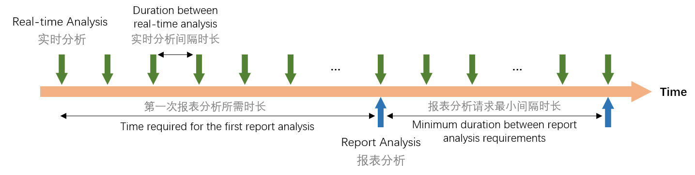

# 会话协议

连接 WebSocket 之后，需要创建会话（session），在会话中与情感云平台进行数据交互。关于 WebSocket 介绍与连接等操作，你可以参考 [WebSocket - Wikipedia](https://en.wikipedia.org/wiki/WebSocket)。

针对会话的操作如下：

| 服务 | 操作 | 说明 |
| --- | --- | --- |
| session | create | 创建会话 |
|  | restore | 恢复会话 |
|  | close | 结束会话 |

## 创建会话（session create）

请求所有情感云数据分析服务必须先进行会话认证

### 创建会话的 Request

创建会话的 Request 结构体如下：

```python
{
    "services": "session",
    "op": "create",
    "kwargs": {
        "app_key": app_key, # 云后台生成的 APP Key
        "user_id": userid,    # 会话关联的唯一用户 ID 的 md5 哈希值（详见下文【会话协议参数说明】）
        "timestamp": timestamp,  # 实时时间戳
        "sign": sign,   # 签名（详见下文【会话协议参数说明】）
        "upload_cycle": upload_cycle  # 上传周期倍数(详见下文【会话协议参数说明】)
    }
}
```

### 创建会话的 Response

创建会话的 Response 结构体如下：

```python
{
    "code": 0,
    "request": {
        "services": "session",
        "op": "start"
    },
    "data": {
        "session_id": session_id    # 会话 ID，每次 Start 连接会生成唯一 ID, 可以用来做会话恢复
    }
}
```

## 恢复会话（session restore)

会话因为网络条件不好而中断，可以选择进行恢复。

:::caution
- 会话保留时间为 10 分钟，10 分钟内可以根据 session_id 来恢复会话，超过 10 分钟会话将会被销毁
- 测试应用的保留时间为 2 分钟
:::

### 恢复会话的 Request

恢复会话的 Request 结构体如下：

```python
{
    "services": "session",
    "op": "restore",
    "kwargs": {
        "app_key": app_key, # 云后台生成的 APP Key
        "session_id": session_id,    # 会话 ID，由 Session Start 生成
        "user_id": userid,    # 会话关联的唯一用户 ID 的 md5 哈希值（详见下文【会话协议参数说明】）
        "timestamp": timestamp,  # 实时时间戳
        "sign": sign,   # 签名（详见下文【会话协议参数说明】）
        "upload_cycle": upload_cycle  # 上传周期倍数(详见下文【会话协议参数说明】)
    }
}
```

### 恢复会话的 Response

恢复会话的 Response 结构体如下：

```python
{
    "code": 0,
    "request": {
        "services": "session",
        "op": "restore"
    }
}
```

## 结束会话（session close)

会话结束后调用。

:::caution
会话结束后一定要调用 session close，否则服务端仍然会保留会话，并产生费用。
:::

### 结束会话的 Request

结束会话的 Request 结构体如下：

```python
{
    "services": "session",
    "op": "close"
}
```

### 结束会话的 Response

结束会话的 Response 结构体如下：

```python
{
    "code": 0,
    "request": {
        "services": "session",
        "op": "close"
    }
}
```

## 会话协议参数说明

### 用户 ID（user_id）

`user_id` 为开发者 App 内的唯一用户 ID 经过 md5 哈希之后的值。
`user_id` 可用于定位会话用户归属，可用于后期数据关联查询和错误追踪。

:::tip
- App 内的唯一用户 id 可为手机号、邮箱、用户 id、账户名等，但需要保证唯一性
- 我们保存的仅为 md5 之后的值，不会知道 app 内用户的原始 id
- 用户上传的 `user_id` 必须为 md5 值，且通过验证接口上传的 `timestamp` 和 `user_id` 必须和参与签名的完全一致
:::

### 签名（sign）

签名步骤如下：

- 从后台获取 `app_secret`。
- 将待签名字符串要求按照参数名进行排序；(首先比较所有参数名的第一个字母，按字母顺序排列，若遇到相同首字母，则看第二个字母，以此类推)。
- 将排好序后的参数拼接成字符串。
- 然后对拼接好后的字符串做 md5。
- md5 后的值全部转为大写。

例如，对于如下的参数进行签名：

```python
app_key = "c821db84-6fbd-11e4-a9e3-c86000d36d7c",
app_secret = "b1a071f0d3f119de465a6d8c9a8c0e7f",
timestamp = 1566971668,  # 实时时间戳
user_id = "098f6bcd4621d373cade4e832627b4f6"

sign_str = "app_key={}&app_secret={}&timestamp={}&user_id={}".format(
    app_key, app_secret, timestamp, user_id
) # 将待签名字符串要求按照参数名进行排序(首先比较所有参数名的第一个字母，按 abcd 顺序排列，若遇到相同首字母，则看第二个字母，以此类推)

sign = hashlib.md5(sign_str).hexdigest().upper()  # sign 即为签名值（需全大写）
```

### 上传周期倍数（upload_cycle） {#upload-cycle}

实时分析服务是通过数据驱动的，即每上传一段时间内采集到的生物信号数据，则触发一次实时分析（包括生物数据分析和生理状态分析）。两次实时分析之间的间隔时长由上传周期倍数 `upload_cycle` 控制，上传周期倍数设置得越大，则实时分析间隔时长越大，每次上传的数据量也越大。



用户可以根据需求，通过设置 `upload_cycle` 参数来设置上传周期倍数。设置合理的上传周期倍数可以有效的降低资源消耗，以及**节省接口使用费用**。在不同的上传周期倍数下，客户端每次上传的数据包帧数也不同，与情感云服务器的上传数据包和接收计算结果包的时间间隔也将随着倍数增大而延长。

不同类型的生物信号数据具有不同的发包频率（具体可参考[原始数据协议](./)），因此在不同的上传周期倍数下，各种生物信号数据的单次上传包数也不同。

下表列举了一些典型的上传周期倍数下，各种生物信号数据的单次上传包数和间隔时长。

| 上传周期倍数 | 单次上传包数 | 理论间隔时长 | 备注 |
| --- | --- | --- | --- |
| 1 | eeg: 50<br/>hr: 3<br/>sceeg: 30<br/>pepr: 15 | 0.6s |  |
| 3 | eeg: 150<br/>hr: 9<br/>sceeg: 90<br/>pepr: 45 | 1.8s | 默认上传周期倍数<br/>需要使用更小上传周期倍数请联系客服 |
| 10 | eeg: 500<br/>hr: 30<br/>sceeg: 300<br/>pepr: 150 | 6s |  |

例如：设置上传周期倍数为 3，客户端需要每次从硬件设备接收到 150 个 EEG 数据包和 9 个 HR 数据包并上传情感云，情感云分析后返回实时分析值，实时分析间隔时长为 1.8 秒。

:::info
- 上传周期倍数可以是 3 ~ 100 之间的任意整数（需要 3 以下的倍数，请联系客服）。
- 每次上传生物信号数据可触发一次相应的生物数据实时分析，并同时触发一次依赖于该生物信号数据的生理状态实时分析（睡眠服务除外）。
- 订阅睡眠服务，则最小上传周期倍数为 10，如果设置上传周期倍数小于 10，则只改变生物数据实时分析的间隔时长，而睡眠计算的间隔时长仍然按照上传周期倍数为 10 的情况（即间隔时间为 6 秒）触发。
:::