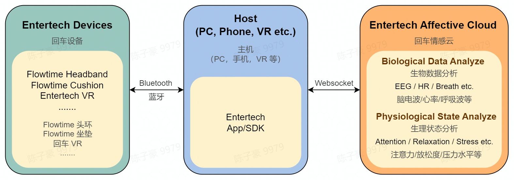

# 情感云

回车情感云平台（简称情感云）可以对设备采集到的原始信号进行分析，实时反馈生物数据和生理状态指标。

主机（PC、手机、VR 等）通过设备管理 SDK 与回车设备连接，控制其采集脑电波、心率、脉搏波等生物信号。在 APP 中集成情感云 SDK，将设备采集到的原始信号上传至情感云，情感云将返回分析后的生物数据与生理状态指标。通过情感云管理后台可以进行数据查找、数据下载、数据统计、实验配置等操作。

- 情感云提供的数据分析服务以及返回的生物数据与生理状态指标请参考[情感云数据分析服务总览](./)。
- 情感云提供的数据分析服务和设备之间的依赖关系请参考[情感云数据分析服务依赖关系](./)。
- 情感云后台管理说明请参考[情感云管理后台使用说明](./)。
