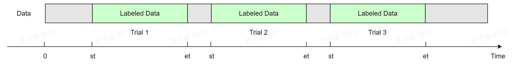

# 标签记录格式

## 标签记录（rec）

如果你使用**心流实验 APP** 采集数据，并且在实验过程中分段记录了标签，那么你需要了解如何从原始数据文件中读取标签信息。



在`label`字段下的`rec`字段为**标签记录**。标签记录用于分段记录具体的标签信息。该字段一般只用于标签数据采集。标签记录最外层为列表，列表中的每个元素为字典类型，分别对应一条**分段标签记录**，分段记录了起始时间、结束时间、标签维度、标签值等信息。具体格式如下。

标签记录 | 分段标签记录 | 取值 | 说明 |
| --- | --- | --- | --- |
| rec | st | float<br/>[0.0, +∞) | 分段起始时间，单位：秒（精确到 0.1 秒）。<br/>分段标签记录起始时刻的相对时间，以会话开始时刻为 0 值 |
|  | et | float<br/>[0.0, +∞) | 分段结束时间，单位：秒（精确到 0.1 秒）。<br/>分段标签记录结束时刻的相对时间，以会话开始时刻为 0 值 |
|  | tag | dict | 标签维度与标签值。tag 为一个字典，其中每一对键值对应一组标签维度和标签值。<br/>详细说明见[标签维度与标签值](#tag)。 |
|  | note | str | 分段备注信息 |

<details>
<summary>rec 示例</summary>

如果在某次实验中，你进行了三项任务，并为每项任务添加了分段标签，则`rec`字段的列表中将会包含 3 个字典，分别记录了每一个分段标签。

```json
"rec": [                                    // 标签记录
        // 第一段分段标签记录
        {                                   // 分段标签记录
            "st": 0.0,                      // 分段起始时间
            "et": 180.6,                    // 分段结束时间
            "tag": {                        // 标签维度与标签值
                "attention": 5,             // 专注程度：5
                "task": "reading"           // 实验任务：阅读
            },
            "note": ["被试眨眼频繁"]         // 分段备注信息
        },
        // 第二段分段标签记录
        {                                   // 分段标签记录
            "st": 200.4,                    // 分段起始时间
            "et": 372.0,                    // 分段结束时间
            "tag": {                        // 标签维度与标签值
                "attention": 4,             // 专注程度：4
                "task": "calculating"       // 实验任务：计算
            },
            "note": ["没有备注信息"]         // 分段备注信息
        },
        // 第三段分段标签记录
        {                                   // 分段标签记录
            "st": 478.8,                    // 分段起始时间
            "et": 581.4,                    // 分段结束时间
            "tag": {                        // 标签维度与标签值
                "attention": 1,             // 专注程度：1
                "task": "rest"              // 实验任务：休息
            },
            "note": []                      // 分段备注信息
        }
]
```

</details>

## 标签维度与标签值（tag） {#tag}

在`rec`字段下的`tag`字段中，保存了**标签维度**与**标签值**。在一次实验中，你可能同时关注不同的实验变量，这些实验变量即标签维度，它们的取值即标签值。

例如在注意力实验中，你可能同时需要记录实验任务类型和被试者的专注程度。在这一实验中，包含实验任务和专注程度两项标签维度，而每一个标签维度下，可以设置不同的标签值，如下表所示。

| 标签维度 | 标签值 |
| --- | --- |
| 实验任务 | 'reading' |
|  | 'calculating' |
|  | 'rest' |
| 专注程度 | '1' |
|  | '2' |
|  | '3' |
|  | '4' |
|  | '5' |

<details>
<summary>tag 示例</summary>

如果在实验中，你为某一个数据片段添加了这样的标签：实验任务为`reading`；专注程度为`5`，则在数据文件中的`tag`字段将呈现如下的信息。

```json
"tag": {                        // 标签维度与标签值
            "attention": "5",   // 专注程度：5
            "task": "reading"   // 实验任务：阅读
        },
```

</details>
