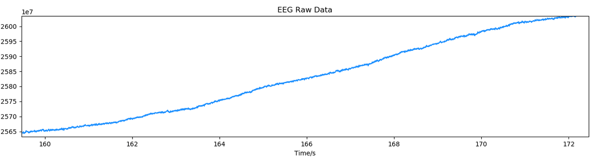

# 原始信号

## 设备采集的原始信号 {#raw-signals-of-devices}

不同设备的传感器不同，可以获取的原始信号也不同。如果你需要获得设备采集到的原始信号，可以通过下表查询设备对应的数据类型，并根据相应的原始数据协议进行解析。

| 设备 | 双通道脑电波 | 单通道脑电波 | 心率 | 压电压阻 |
| :---: | :---: | :---: | :---: | :---: |
| Flowtime 头环 | √ |  | √ |  |
| Flowtime 坐垫 |  |  |  | √ |
| 回车 VR | √ |  | √ |  |
| 热敷眼罩 |  | √ |  |  |

### 双通道脑电波 {#double-channel-eeg-raw-signal}

### 单通道脑电波 {#single-channel-eeg-raw-signal}

### 心率 {#heart-rate-raw-signal}

### 压电压阻 {#pepr-raw-signal}

## 原始数据格式与解析 {#raw-signals-protocol}

原始数据是指设备蓝牙传输的硬件数据，你可以通过以下途径获取原始数据：

- 使用设备管理 SDK 实时获取原始数据
- 使用情感云并通过情感云管理后台下载原始数据文件

每一种原始信号都由相应的原始数据解析得到，我们提供了各种原始数据的格式及其解析方法，你可以参考[原始数据协议](../raw-data-protocol)来获得所需的原始信号。
