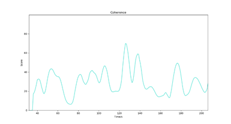
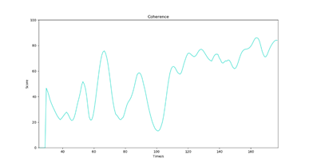
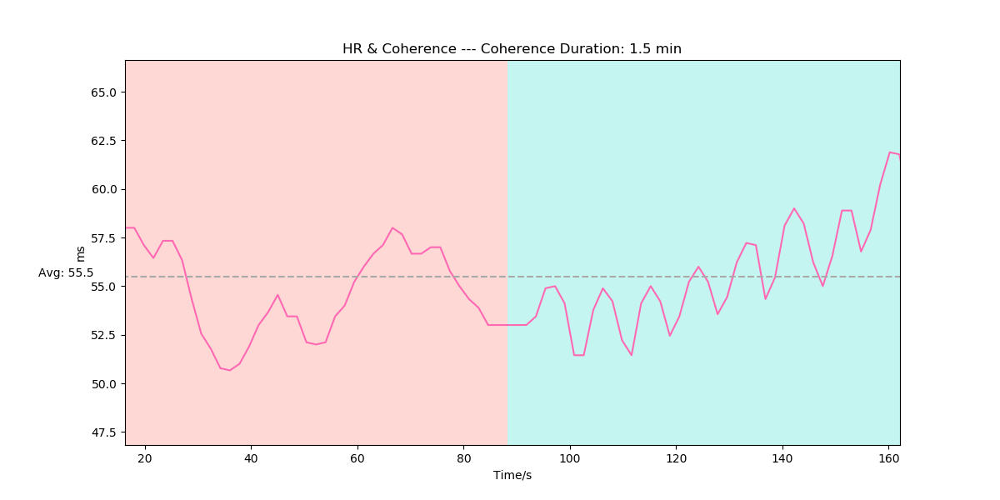
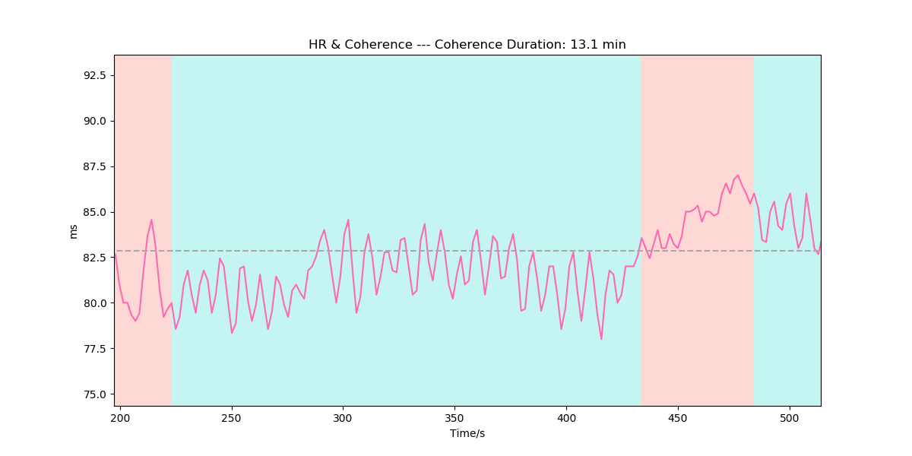
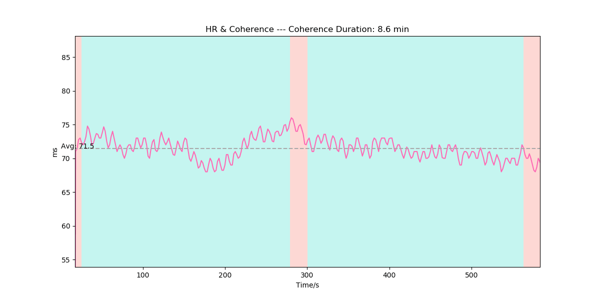

# 和谐度（Coherence）

## 名词解释
研究表明，情绪与心率变化的模式有关[^1]。积极的情绪可以提高自主神经系统（ANS）两个分支之间的协调性，增加不同生理系统之间的共振，达到“心脑同步”的和谐状态[^2]。这种状态与专注力、快速反应、记忆力和情绪稳定性的提高有关[^2][^3]。

和谐度监测算法通过分析心率和心率变异性等生理指标来评价自主神经系统的和谐程度。和谐度的值越高表明身体各个系统越和谐，值越低表明身体各个系统越无序。

和谐与放松不同。放松主要是副交感神经活动增加，是一种脱离认知和情感的休息状态；而和谐强调交感神经系统与副交感神经系统的同步，以高度有序、平稳的心率变化模式为标志，是一种认知增强、充满活力的平静状态。

呼吸模式会影响心率变化的模式[^4]。通过缓慢而有规律的深呼吸（吸气5秒，呼气5秒）可以使交感神经系统与副交感神经系统相互同步，提高和谐度的值。

---

## 最佳实践

:::tip
通过「最佳实践」，我们会提供一些我们已经实践过的应用场景供你参考，通过这些例子你可以了解如何将我们提供的数据和你的应用场景结合。
:::

### 和谐度在冥想中的应用

和谐度与冥想过程中的呼吸模式有关。通过有规律的深呼吸训练（吸气5秒，呼气5秒）可以使自主神经系统（ANS）的两个分支——交感神经系统与副交感神经系统相互同步，促进生理系统的有效运作与认知功能的改善，达到心-脑和谐的状态。长期的呼吸训练可以使身体更容易进入和谐状态并将和谐度维持在较高水平。

#### 普通状态下的和谐度变化

普通状态下的和谐度整体处于较低水平。

#### 冥想中呼吸练习前后的和谐度变化

后半段进入呼吸练习，和谐度升高并维持较高水平。

### 心率与和谐（HR & Coherence）

冥想过程中的呼吸模式会影响心率变化的模式。

通过缓慢而有规律的深呼吸（吸气5秒，呼气5秒）可以使交感神经系统与副交感神经系统相互同步，增加不同生理系统之间的共振，达到“心脑同步”的和谐状态。这种状态与专注力、快速反应、记忆力和情绪稳定性的提高有关。

心率变化曲线可以直观反映冥想过程中的和谐状态，一般状态下心率的变化呈现无序性，通过有规律的深呼吸可以使心率呈现周期性节律，达到心-脑和谐的状态。利用算法返回的和谐度标志，可以对心率曲线进行标记，区分和谐与非和谐状态。

#### 心率曲线与和谐状态

粉色曲线为心率，红色背景部分心率呈现无序变化，绿色背景部分通过有规律的深呼吸达到和谐状态，使心率呈现周期性。

 | 
---|---

#### 有经验的冥想者在呼吸练习中的心率与和谐状态

有经验的冥想者在呼吸练习中可以持续稳定地维持在和谐状态，心率持续呈现周期性。

***参考文献***

[^1]: McCraty, Rollin. (2006). Emotional Stress, Positive Emotions and Psychophysiological Coherence. 
[^2]: McCraty, Rollin. (2005). Enhancing Emotional, Social, and Academic Learning With Heart Rhythm Coherence Feedback. Biofeedback and Self-Regulation. 33. 130-134. 
[^3]: Edwards, Stephen. (2014). Evaluation of heart rhythm coherence feedback training on physiological and psychological variables. South African journal of psychology = Suid-Afrikaanse tydskrif vir sielkunde. 2014. 73– 82. 10.1177/0081246313516255. 
[^4]: Courtney, Rosalba & Cohen, Marc & Dixhoorn, Jan. (2011). Relationship Between Dysfunctional Breathing Patterns and Ability to Achieve Target Heart Rate Variability With Features of "Coherence" During Biofeedback. Alternative therapies in health and medicine. 17. 38-44. 
