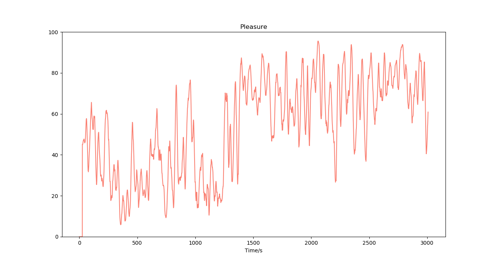

# 愉悦度（Pleasure）*Beta*

## 名词解释

研究表明，左脑前额皮质更活跃，会让人产生积极情绪，而右脑前额皮质更活跃，则意味着消极情绪[^1][^2]。与正常人相比，抑郁症和焦虑症患者的左右前额脑电波具有更明显的不对称性[^3][^4]。

愉悦度监测算法基于大量数据建模，并通过实时分析左右前额脑电波的频谱特征从而计算愉悦度，用于评价情绪的积极程度。愉悦度的值越高表明越积极，值越低表明越消极。

通过正念、冥想等方式可以改善情绪，提高愉悦度的值。

左右脑活跃程度可能还受到当前活动的影响，比如在进行计算、推理等活动时左脑更加活跃，而在进行想象、欣赏等活动时右脑更加活跃，因此愉悦度的测量不一定能反映主观感受。体验过程中的某些激发想象力与创造力的活动可能会使右脑活跃，从而导致愉悦度的测量值偏低。

:::info
由于每个人在正常状态下的左右前额活跃程度不同，愉悦度监测算法会在体验的初始阶段采集基线来进行自适应，为了获得较好的体验，在体验开始的前30秒可尽量减少面部活动（如眨眼、眼动、咬牙等）带来的干扰。
:::

## 最佳实践

### 愉悦度在冥想中的应用

愉悦度的变化依赖于具体的冥想形式。在大多数冥想过程中，愉悦度可能因体验者的积极情绪而呈现上升趋势，但也有某些冥想方式会让体验者尝试想象自身正在经受苦难，这可能会使愉悦度有降低的趋势，而当体验者客观地、不予评价地与觉察身体的感知时，愉悦度可能保持在中性水平。

#### 冥想过程中的愉悦度变化

两种不同的冥想方法下的愉悦度变化，前半段愉悦度较低，后半段愉悦度较高

---

***参考文献***

[^1]: Davidson R J, Ekman P, Saron C, Senulis J, Friesen W V. Approach/withdrawal and cerebral asymmetry: Emotional expression and brain physiology: I. Journal of Personality and Social Psychology, 1990, 58: 330~34
[^2]: Sutton S K, Davidson R J, Donzella B, Irwin W, Dottl D A. Manipulating affective state using extended picture presentation. Psychophysiology, 1997, 34: 217:226
[^3]: Gotlib, Ian. (1998). EEG Alpha Asymmetry, Depression, and Cognitive Functioning. Cognition & Emotion - COGNITION EMOTION. 12. 449-478. 10.1080/026999398379673.
[^4]: Mennella, Rocco & Patron, Elisabetta & Palomba, Daniela. (2017). Frontal alpha asymmetry neurofeedback for the reduction of negative affect and anxiety. Behaviour Research and Therapy. 92. 10.1016/j.brat.2017.02.002.
