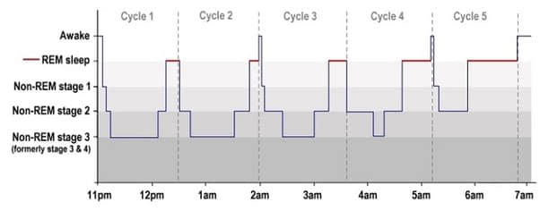
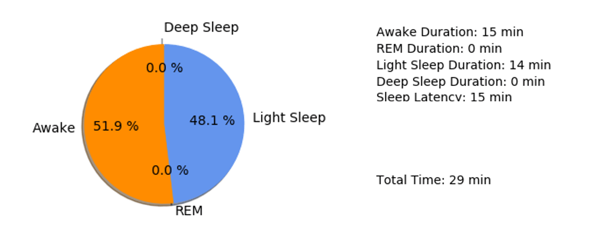
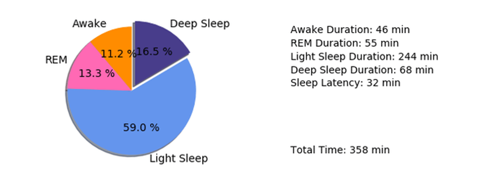

# 睡眠（Sleep）

## 名词解释

### 睡眠监测

在不同睡眠阶段，脑电波会表现出不同的时域和频域特征[^1]。清醒状态下β波能量较高，闭眼放松时α波能量会增加，进入浅睡状态后θ波能量较高，脑电波的波形复杂度也会下降，而在深睡状态下则会出现δ波。

医学上往往通过医生的经验来判断脑电波对应的睡眠阶段，利用深度学习技术建模，可以达到与医学上相近的准确率[^2][^3]。

睡眠监测算法通过提取脑电波的时域与频域特征进行深度学习，结合大量数据建模，从而判断睡眠状态。

:::info
由于每个人的脑电节律存在差异，睡眠监测算法会在体验的初始阶段采集基线来进行自适应。为了获得较好的体验，在体验开始的前1分钟请尽量减少面部活动（如眨眼、眼动、咬牙等）带来的干扰。采集基线的过程默认为清醒状态，若在此过程中就入睡或在已入睡的情况下开始体验，则结果可能存在偏差。
:::

### 睡眠状态（Sleep State）

实时判断入睡情况（是否入睡），可用于控制睡眠环境中的某些设备（如关闭音乐、关闭灯光等）。

:::info
睡眠状态倾向于判断为清醒，以更大概率确保在使用者在入睡后再切换设备状态，因此睡眠状态的变化不一定反映入睡时刻，具体的入睡时刻将通过入睡点给出。
:::

### 睡眠程度（Sleep Degree）

实时反映睡眠的深度，可用于实时观察使用者的睡眠情况。

实时计算的睡眠程度未经过总体校正，因此在清醒、浅睡与深睡之间没有固定的界限划分，但睡眠程度的相对变化仍可实时反映睡眠状态倾向。睡眠程度的值越大表明越接近清醒，值越小表明越接近深睡。

:::info
某一时刻得到的睡眠程度值并不能简单通过阈值划分的方式来判断使用者是清醒、浅睡或深睡，但睡眠程度在一段时间内的变化趋势可以一定程度上反映使用者的状态变化情况。主要比较前后趋势来做实时的比较。
:::

### 睡眠分期（Sleep Stage）

睡眠分期更适合在长时间的睡眠体验中使用，能够更直观地反映整个睡眠过程中的状态变化。

睡眠分期包括 REM 期（快速眼动期）与 NREM 期（非快速眼动期）两大类，其中 NREM 期可分为 N1~N3 期（AASM 标准，另 R&K 标准将 NREM 期分为 N1~N4 期，其中 N3 期与 N4 期合并即为 AASM 标准中的 N3 期[^4]），N1 与 N2 期对应浅睡眠，N3 期对应深睡眠。REM 期一般表现为眼球快速运动，大多数情况下人们在 REM 期会做梦。

#### 睡眠分期示意图（AASM 标准）

依据睡眠分期标准，从实时的脑电波数据中提取特征，结合机器学习方法，对睡眠分期进行分类，得到整个睡眠过程的睡眠分期记录。睡眠分期分为：清醒期、N1 期、N2 期、N3 期和 REM 期。

#### 典型的睡眠分期

图中紫色折线为睡眠分期，可以看出睡眠周期，并且随着睡眠时间推移，N3 期减少，REM 期增加。

### 睡眠曲线（Sleep Curve）

睡眠曲线更适合在小睡体验中使用，可以反映睡眠过程中状态变化的细节。

睡眠曲线经过了综合校正，能够更准确地反映整个体验过程中的睡眠情况。睡眠曲线的值越高表明越接近清醒，曲线值越低表明越接近深睡。

:::info
由于 REM 期的脑电波特征与 N1 期较为相似，因此这一状态可能导致睡眠曲线中间出现一个高峰，峰值接近清醒值。
:::

睡眠状态可根据曲线值进行划分，这里提供一种划分建议。

| 睡眠状态 | 睡眠曲线值范围 |
| :---: | :---: |
| 清醒 | 80~100 |
| 迷糊 | 70~80 |
| 浅睡 | 30~70 |
| 深睡 | 0~30 |

### 入睡点（Sleep Point）

综合分析完整睡眠过程中的脑电波变化情况，在睡眠曲线上给出系统判定的入睡时刻。

入睡点经过了综合校正，能够更准确地反映入睡时刻。

若该次体验未入睡，则入睡点不会在睡眠曲线上标出。

#### 典型的小睡过程睡眠曲线与入睡点标记

#### 进入深睡的小睡过程睡眠曲线与入睡点标记

#### 未入睡情况下的睡眠曲线

### 时长统计（Duration）

根据完整的睡眠情况对各个睡眠阶段的时长进行统计。

在使用睡眠分期的情况下，时长统计包括：清醒时长、浅睡时长、深睡时长、REM 期时长、入睡用时。

在未使用睡眠分期的情况下，时长统计包括：清醒时长、浅睡时长、深睡时长、入睡用时。

- 清醒时长（awake duration）：主要包括入睡前的清醒时段与醒来后的入睡时段。在未使用睡眠分期的情况下，清醒时长的统计可能包含少量中途做梦的时长。
- 快速眼动时长（rem duration）：快速眼动睡眠的时长。在此睡眠阶段中，眼球会快速移动，同时身体肌肉放松，REM 期往往与做梦有关。
- 浅睡时长（light duration）：睡眠过程中浅睡状态（N1 与 N2 期）的时长。主要出现在小睡过程中和夜间睡眠中的大部分，充足的浅睡眠能够恢复精神，提高人体的免疫力。
- 深睡时长（deep duration）：睡眠过程中深睡状态（N3 期）的时长。在夜间睡眠中出现，一般占总时长的 15%~25%，充足的深睡眠能够恢复体力，促进新陈代谢。
- 入睡用时（sleep latency）：根据入睡点计算得到的入睡所用时长。值越小表明入睡速度越快。
正常的小睡，一般只会进入浅睡眠，若小睡时间过长，有可能进入深睡眠，此时醒来会出现头晕、无力等现象。

正常的夜间睡眠，一般由浅睡眠与深睡眠交替，形成睡眠周期。在睡眠的前 3 小时深睡占比较大，之后睡眠以浅睡为主。

### 高级数据分析（Advanced Analysis）
#### 睡眠稳定度

##### 体动次数

睡眠过程的身体动作。动作越多，说明睡得越不安穏。

##### 微觉醒次数

睡眠期间去甲肾上腺素的波动会引起微觉醒。微觉醒的时候，脑波会呈现高频抖动。微觉醒十分短暂，一般持 5~10s，不会打断睡眠，过于频繁的微觉醒会引起日间嗜睡。

#### 睡眠抗干扰能力

睡眠纺锤波是频率范围为 11~16 Hz，持续时间为 0.5~1s 的梭状波形，形成于丘脑—一个负责控制睡眠同时向大脑皮层处理和转达感官信息的大脑区域。在浅睡眠甚至是深睡眠中出现，每分钟 3-6 次，保护大脑不受外界噪声的干扰扰，从而守护睡眠。一个人的睡眠纺锤波越强、越频繁，就越能适应外界的噪声，否则可能容易被吵醒。

根据特定睡眠阶段的纺锤波能量评估睡眠的抗干扰能力。睡眠抗干扰能力为 0-100，大部分人在 40-60 之间。纺锤波能量越高，睡眠抗干扰能力越强。

:::info
睡眠高级数据分析默认不开启，需要在订阅服务的时候开启 'advanced_analysis=True'，具体见情感计算服务协议。
:::

## 最佳实践

### 智能硬件的睡眠辅助

#### 睡眠状态（Sleep State）的应用

- 通过给出的入睡判断，自动停止助眠音乐。
- 通过睡眠状态（Sleep State）给出的入睡判断，自动关闭灯光。

#### 睡眠程度（Sleep Degree）的应用

- 根据睡眠程度实时谱曲，通过正反馈谱出的助眠曲，帮助用户快速入睡。
- 通过睡眠程度调节灯光的亮度，营造最合适的睡眠环境。

---

***参考文献***

[^1]: Binder, Marc.D., Hirokawa N., Windhorst U. (2009). Encyclopedia of Neuroscience. 10.1007/978-3-540-29678-2_2893
[^2]: Supratak, Akara & Dong, Hao & Wu, Chao & Guo, Yike. (2017). DeepSleepNet: a Model for Automatic Sleep Stage Scoring based on Raw Single-Channel EEG. IEEE Transactions on Neural Systems and Rehabilitation Engineering. PP. 10.1109/TNSRE.2017.2721116.
[^3]: Xu, Fuxian. (2019). A Review of Automatic Sleep Staging. Biophysics. 07. 34-48. 10.12677/BIPHY.2019.73004.
[^4]: Moser, D., Anderer, P., Gruber, G., Parapatics, S., Loretz, E., Boeck, M., Kloesch, G., Heller, E., Schmidt, A., Danker-Hopfe, H., Saletu, B., Zeitlhofer, J., & Dorffner, G. (2009). Sleep classification according to AASM and Rechtschaffen & Kales: effects on sleep scoring parameters. Sleep, 32(2), 139–149. https://doi.org/10.1093/sleep/32.2.139
