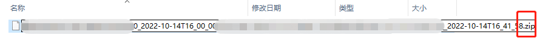
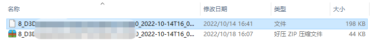

# 获取生物数据与生理状态指标

## 使用情感云管理后台下载报表文件 {#from-affective-cloud-manager-backstage}

### 报表文件下载

- 登录[情感云管理后台](http://admin.affectivecloud.cn)。
- 在**使用记录**中选择**生物数据分析服务**或**生理状态分析服务**，找到目标记录。
- 点击**操作**一列中的**下载报表文件**，可以得到压缩的报表文件，后缀名对应不同的生物数据分析或生理状态分析服务类型，如 .eeg.report 为双通道脑电波，.attention.report 为注意力。
- 更多情感云管理后台相关使用说明请参考[情感云管理后台使用说明](https://entertech.feishu.cn/docx/IJaYdP3JvoyWMLxhtzlcfN7rnwd)。

### 报表文件解压

- 情感云管理后台直接下载得到的原始数据文件是 gzip 压缩的，在读取之前需要先解压缩。
- 如果你的电脑中安装了 .zip 解压缩软件，你可以将下载的压缩原始数据文件后缀名更改为 .zip，并用解压缩软件直接解压，得到可以打开的文本文件。
- 如果你正在使用 Python，你也可以通过代码的方式来解压缩。




```python
import gzip
import json

with open(path, 'rb') as fr:  # path为压缩文件的路径
    content = fr.read()
    bin_data = gzip.decompress(content)
json_data = json.loads(bin_data)
with open(path + '_unz', 'w') as f:  # path+'_unz'为解压缩后的文件保存路径
    json.dump(json_data, f)
```

### 报表文件读取

- 解压缩后的文件可直接读取为 json，读取`data`字段中`report`字段保存的内容，即为十进制无符号 int 型原始数据。例如：`[0,0,119,7,236,...,136,214,58]`。
- 具体的报表文件格式可参考[报表文件](../data-files-protocol/report-files)。
- 生物数据报表文件内容说明请参考[生物数据报表分析返回值](../data-format/biological-data#biological-data-report-analysis-returns)。
- 生理状态报表文件内容说明请参考[生理状态报表分析返回值](../data-format/physiological-state-metrics#physiological-state-report-analysis-returns)。
- 如果你正在使用 Python，你也可以直接利用下面的代码从解压后的文件中读取报表分析结果。

```python
import json

with open(path, 'r') as f:  # path为解压缩后的文件的路径
    content = json.load(f)
raw_data = content.get('data').get('raw')  # raw_data 即为十进制无符号 int 型原始数据
```

## 使用本地化数据分析 SDK 获取生物数据和生理状态指标 {#from-local-data-analysis-sdk}

如果你希望获得与情感云类似的数据分析服务，但由于使用场景不适合联网，我们还提供了本地化数据分析 SDK 供你开发无需联网使用的本地应用。

使用本地化数据分析 SDK 进行开发，你可以实时获取算法分析得到的生物数据和生理状态指标，也可以在体验结束后获取相应的报表分析。

在使用本地化数据分析 SDK 进行开发之前，你需要先根据自己的设备接入相应的设备管理 SDK，实现设备连接、数据采集等功能。

- [本地化数据分析 SDK](./)
- [设备管理 SDK](../../devices#develop-resources)
- 算法分析得到的生物数据详细说明请参考[生物数据分析返回值](../data-format/biological-data)
- 算法分析得到的生理状态指标详细说明请参考[生理状态分析返回值](../data-format/physiological-state-metrics)
