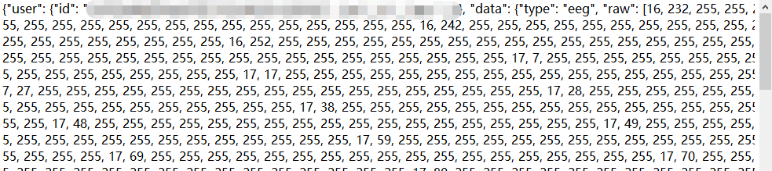

# 获取原始信号

## 使用设备管理 SDK 获取原始信号 {#from-device-manager-sdk}

### 设备管理 SDK 接入

我们为不同设备、不同平台的开发者提供了[设备管理开发资源](../../devices#develop-resources)。你可以使用我们已经开发好的 SDK 快速接入，实现管理设备连接、数据采集等功能，并利用我们提供的 Demo 进行测试。

### 原始信号解析

接入 SDK 后，你可以在客户端实时接收到字节流数据，即 byte 型数组。将其转换为**十进制无符号 int 型**数组，即十进制原始数据包。转换之后，每个字节数据将转变为一个 **0~255** 的 int 型数据。

:::info
对于心率数据，由于每个包只有一个字节，客户端实时接收到的字节流数据为单个的 byte 型，直接将其转换为十进制无符号 int 型数据即可。
:::


转换后，根据[原始数据协议](../raw-data-protocol)解析得到原始信号。

## 使用情感云管理后台下载原始数据 {#from-affective-cloud-manager-backstage}

### 原始数据文件下载

- 登录[情感云管理后台](./)。
- 在**使用记录**中选择**生物数据分析服务**，找到目标记录。
- 点击**操作**一列中的**下载原始数据**，可以得到压缩的原始数据文件，后缀名 .eeg 为双通道脑电波，.hr 为心率。


### 原始数据文件解压

- 情感云管理后台直接下载得到的原始数据文件是 gzip 压缩的，在读取之前需要先解压缩。
- 如果你的电脑中安装了 .zip 解压缩软件，你可以将下载的压缩原始数据文件后缀名更改为 .zip，并用解压缩软件直接解压，得到可以打开的文本文件。




- 如果你正在使用 Python，你也可以通过代码的方式来解压缩。

```python
import gzip
import json

with open(path, 'rb') as fr:  # path为压缩文件的路径
    content = fr.read()
    bin_data = gzip.decompress(content)
json_data = json.loads(bin_data)
with open(path + '_unz', 'w') as f:  # path+'_unz'为解压缩后的文件保存路径
    json.dump(json_data, f)
```

### 原始数据文件读取

- 解压缩后的文件可直接读取为 json，读取`data`字段中`raw`字段保存的数组，即为十进制无符号 int 型原始数据。例如：`[0,0,119,7,236,...,136,214,58]`。
- 具体的原始数据文件格式可参考[数据文件格式](./)。
- 如果你正在使用 Python，你也可以直接利用下面的代码从解压后的文件中读取十进制无符号 int 型原始数据。

```python
import json

with open(path, 'r') as f:  # path为解压缩后的文件的路径
    content = json.load(f)
raw_data = content.get('data').get('raw')  # raw_data 即为十进制无符号 int 型原始数据
```

### 原始信号解析

- 从原始数据文件中读取得到的十进制无符号 int 型原始数据是当次会话中所有数据包拼接而成的，因此需要先按照不同数据类型的数据包长度拆分成独立的数据包。
- 拆分后得到的独立数据包根据[原始数据协议](../raw-data-protocol)解析可得到每个数据包的原始信号。
- 将每个数据包解析得到的原始信号拼接，可得到当次会话完整的原始信号。
