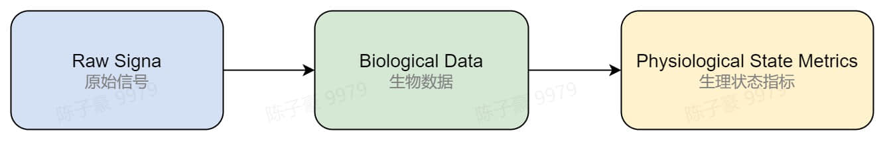
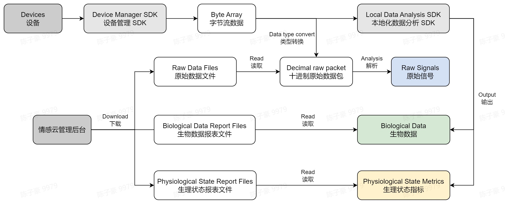

# 数据

## 数据类别

我们约定了不同数据类别的命名规范，你可以通过下表了解不同类别的数据所代表的含义，方便你理解其他内容。

| 数据类别 | 说明 |
|----------|----|
| 原始信号 | 使用设备采集到的原始信号。包括脑电波原始信号、心率数据、压电信号等。不同设备的传感器不同，可以获取的原始信号也不同，具体情况可参考[设备采集的原始信号](./data/data-format/raw-signals#raw-signals-of-devices)。 |
| 生物数据 | 对原始信号进行信号处理和特征分析后得到的客观的生物数据。包括脑电波、脑电波节律能量、心率、HRV 等。 |
| 生理状态指标 | 对生物数据进行算法分析得到的更直观的生理状态指标。例如通过分析脑电波特征可以得到注意力、放松度等。 |

## 数据类别、开发状态和支持设备

| 数据类型 | 数据  | 开发状态 | 支持设备 |
|:----------:|----------|----------|----|
| 原始信号 | 电波原始信号               | -        | Flowtime 头环 / 回车VR / 热敷助眠眼罩          |
|          | 心率数据                   | -        | Flowtime 头环 / 回车VR / 热敷助眠眼罩          |
|          | 压电信号                   | -        | Flowtime 坐垫                                  |
| 生物数据 | 脑电波（EEG）                | Released | Flowtime 头环 / 回车VR / 热敷助眠眼罩  |
|          | 心率（HR）                   | Released | Flowtime 头环 / 回车VR / Flowtime 坐垫 |
|          | 脉搏波（BCG）                | Released | Flowtime 坐垫                                  |
|          | 呼吸（Breath）               | Released | Flowtime 坐垫                                  |
| 生理状态指标 | 注意力（Attention）          | Released | Flowtime 头环 / 回车VR                 |
|          | 儿童专注力（Attention CHD）  | Beta     | Flowtime 头环 / 回车VR                 |
|          | 放松度（Relaxation）         | Released | Flowtime 头环 / 回车VR / 热敷助眠眼罩  |
|          | 儿童放松度（Relaxation CHD） | Beta     | Flowtime 头环 / 回车VR                 |
|          | 压力水平（Pressure）         | Released | Flowtime 头环 / 回车VR / Flowtime 坐垫 |
|          | 愉悦度（Pleasure）           | Beta     | Flowtime 头环 / 回车VR                 |
|          | 激活度（Arousal）            | Beta     | Flowtime 头环 / 回车VR                 |
|          | 和谐度（Coherence）          | Released | Flowtime 头环 / 回车VR                 |
|          | 睡眠（Sleep）                | Released | Flowtime 头环 / 回车VR / 热敷助眠眼罩  |

具体数据说明可以参考本章节的数据说明部分的介绍。

## 数据获取途径

原始信号、生物数据和生理状态指标的获取途径如下：

- 设备采集到的原始信号通过蓝牙传输到客户端，客户端接收到的数据为字节流，将其转换为十进制原始数据包后，根据原始数据协议解析得到原始信号。
- 情感云管理后台可以下载原始数据文件以及生物数据、生理状态的报表文件。其中，原始数据文件中记录了当次会话的原始数据信息，从中可读取十进制原始数据包，并根据原始数据协议解析得到原始信号。报表文件分为生物数据报表文件和生理状态报表文件，从中可读取得到各种情感云服务的报表分析结果。
- 使用设备管理 SDK 和本地化数据分析 SDK 进行开发，可以直接实时输出生物数据和生理状态指标。

我们开放相关的数据获取方法，便于你进行自主开发和研究。

- 如果你需要实时获取设备采集到的原始信号，我们提供了相关的开发资源供你连接设备并实时获取数据。
  - [使用设备管理 SDK 获取原始信号](./data/get-data/get-raw-signals#from-device-manager-sdk)
- 如果你正在使用情感云数据分析服务，我们会在情感云管理后台保存每一次会话的原始数据文件以及生物数据、生理状态的报表文件，便于你进行离线分析。
  - [使用情感云管理后台下载原始信号](./data/get-data/get-raw-signals#from-affective-cloud-manager-backstage)
  - [使用情感云管理后台下载报表文件](./data/get-data/get-biological-data-and-physiological-state-metrics#from-affective-cloud-manager-backstage)
- 如果你正在使用本地化数据分析 SDK，你可以直接通过 SDK 实时输出生物数据和生理状态指标，并自行保存。
  - [使用本地化数据分析 SDK 获取生物数据和生理状态指标](./data/get-data/get-biological-data-and-physiological-state-metrics#from-local-data-analysis-sdk)
