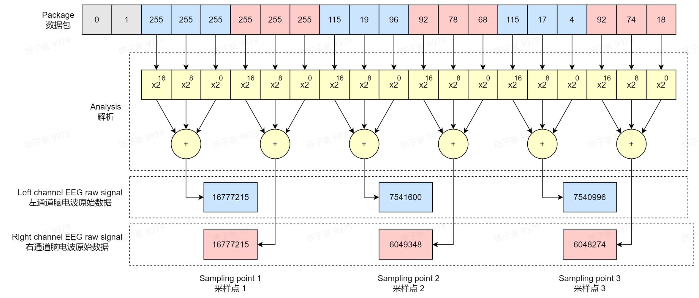
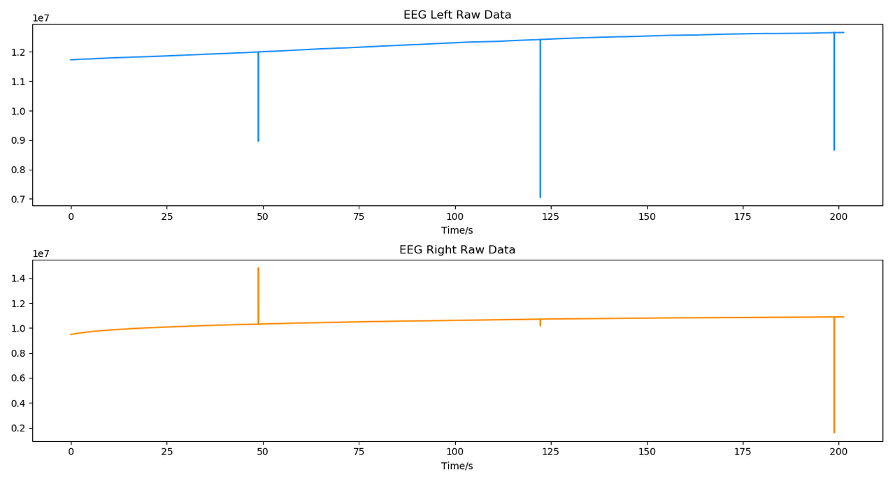
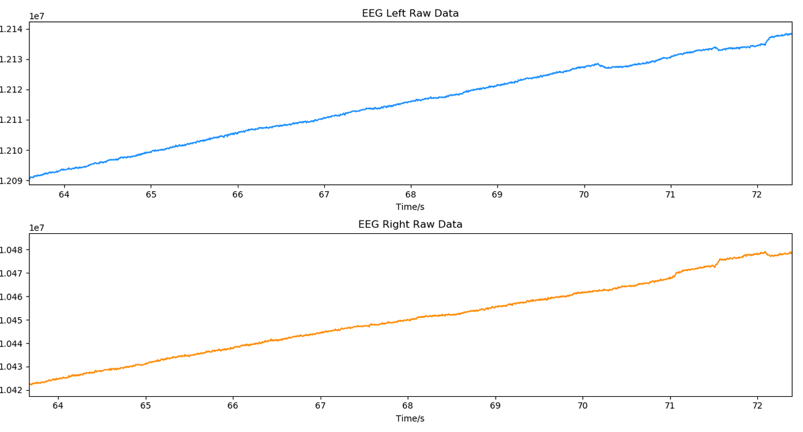

# 双通道脑电波数据协议

:::caution
在进行解析前，请确保你已经进行了如下处理：

- 如果你正在从设备实时获取硬件数据包，请确保已将字节流数据转换为**十进制无符号 int 型**（注意每个数据范围为 0~255，而不是 -128~127）。
- 如果你是从情感云管理后台下载的原始数据文件中获取的数据，请先按照不同类型数据包的长度，将其按顺序拆分为若干数据包，再进行解析。
:::

## 双通道脑电波数据包格式

一个双通道脑电波数据包由包序号和脑电波数据组成，其中脑电波数据包括左右通道各 3 个数据采样点。

| 包内容 | 包序号 | 左通道 采样点 1 | 右通道 采样点 1 | 左通道 采样点 2 | 右通道 采样点 2 | 左通道 采样点 3 | 右通道 采样点 3 |
| :---: | :---: | :---: | :---: | :---: | :---: | :---: | :---: |
| 字节数 | 2 | 3 | 3 | 3 | 3 | 3 | 3 |

- 数据包长度：20 字节
- 采样率：250 Hz（每个通道）

## 双通道脑电波数据解析方法

每一个脑电数据采样点由 3 个字节组成，服从大端格式。

由于我们已经将数据包转换为十进制 int 型数据，因此可直接按照下面的方法解析得到每个数据采样点的数值。例如，对于数据包中的 `115, 19, 96`，其解析值为：$115\times2^{16} + 19\times2^{8} + 96\times2^{0} = 7541600$。

双通道脑电波原始信号示例

典型的双通道脑电波原始信号如下图，由于原始脑电波中存在较大的漂移电压，而脑电波电压幅值非常小（微伏级），因此很难通过肉眼从原始脑电波数据图中看出脑电波特征，将其局部放大或经过滤除漂移等处理后，可见细微的波形特征。

:::tip
脑电波原始信号中可能偶尔出现一个离群点，是数据传输丢失导致的，对于这种情况可手动将该离群点剔除。
:::

**双通道脑电波原始信号**

**双通道脑电波原始信号局部放大**

## 脑电波电压计算方法

如果你需要计算实际的脑电波电压幅值，则需要经过下面的处理。

解析得到的每个采样点数值范围为 0~2^24-1，将其线性映射到  -2.4~2.4V 即为设备输出的脑电波电压值。由于脑电波采集过程中经过了硬件放大，放大倍数为 12 倍，因此，将映射得到的脑电波电压值除以 12 可得原始的脑电波信号电压值。