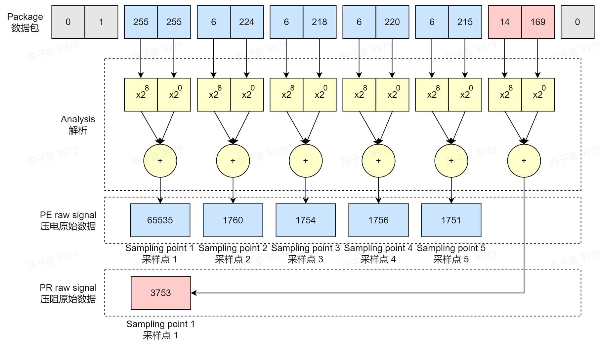
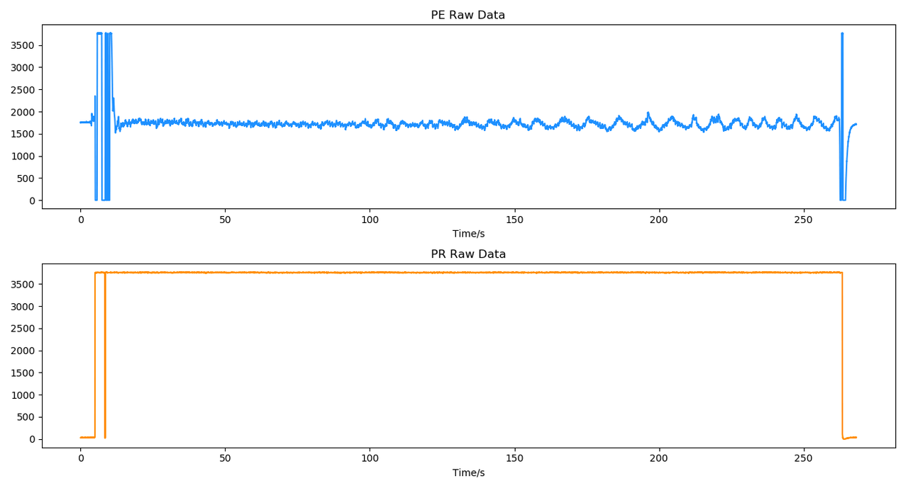
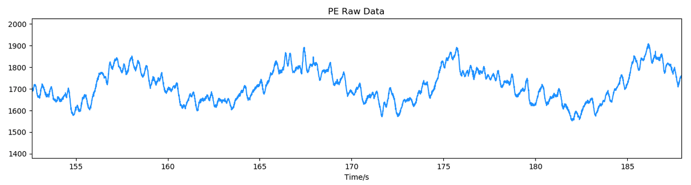

# 压电压阻数据协议

:::caution
在进行解析前，请确保你已经进行了如下处理：

- 如果你正在从设备实时获取硬件数据包，请确保已将字节流数据转换为**十进制无符号 int 型**（注意每个数据范围为 0~255，而不是 -128~127）。
- 如果你是从情感云管理后台下载的原始数据文件中获取的数据，请先按照不同类型数据包的长度，将其按顺序拆分为若干数据包，再进行解析。
:::

## 压电压阻数据包格式

一个压电压阻数据包由包序号、压电数据、压阻数据和校验位组成，其中压电数据包括 5 个数据采样点，压阻数据包括 1 个采样点。

| 包内容 | 包序号 | 压电数据 采样点 1 | 压电数据 采样点 2 | 压电数据 采样点 2 | 压电数据 采样点 4 | 压电数据 采样点 5 | 压阻数据 采样点 | 校验位 |
| :---: | :---: | :---: | :---: | :---: | :---: | :---: | :---: | :---: |
| 字节数 | 2 | 2 | 2 | 2 | 2 | 2 | 2 | 1 |

- 数据包长度：15 字节
- 采样率：
  - 压电数据：125 Hz
  - 压阻数据：25 Hz

## 压电压阻数据解析方法

每一个压电数据、压阻数据采样点均由 2 个字节组成，服从大端格式。

由于我们已经将数据包转换为十进制 int 型数据，因此可直接按照下面的方法解析得到每个数据采样点的数值。例如：对于数据包中的 `6, 224`，其解析值为：$6\times2^{8} + 224\times2^{0} = 1760$。

压电压阻原始信号示例

典型的压电压阻原始信号如下图，由于压电传感器对压力变化十分灵敏，通过压电信号可以反映人体的脉搏波、呼吸等特征，而压阻信号可以反映人体与传感器之间的压力，可用于显示人体与传感器之间是否接触良好。

**压电压阻原始信号**

**压电原始信号局部放大**（可见清晰的脉搏波、呼吸波）

