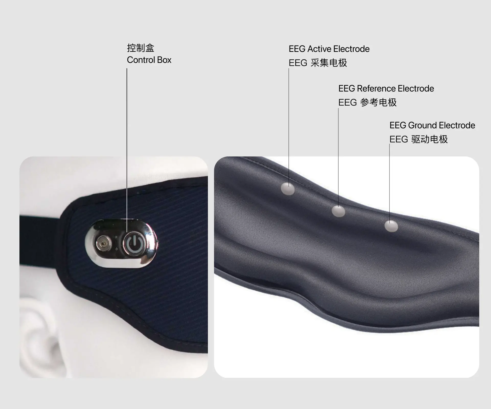

# 热敷助眠眼罩

## 硬件说明 {#hardware-instructions}

回车热敷助眠眼罩，集成了单通道脑电。集成了热敷和脑电采集功能。

- 单通道脑电（EEG）采集
    - 采集电极位点：Fp1
    - 参考电极位点：Fpz
    - 采样率：250 Hz
    - 采样精度：24 位
- 电池：1000 mAh
- 操作系统：iOS 11.2 +/ Android 6.0 +
- 蓝牙：BLE 5.0+

## 使用说明 {#operating-instructions}

### 连接 {#connecting}

- 关闭热敷状态下
  - 在关机状态下，长按按键直至指示灯亮起，设备开机并进入广播状态，此时可以使用蓝牙主机设备搜索并连接设备。开机后设备会一直广播直到关机。
  - 设备连接主机后指示灯将切换到长亮状态，此时可以通过指令控制设备进行采集等操作。
  - 设备和主机断开连接后即进入广播状态，此时可以使用蓝牙主机设备搜索并连接设备。
- 开启热敷状态
  - 在关机状态下，长按按键直至指示灯亮起，设备开机并进入广播状态，此时可以使用蓝牙主机设备搜索并连接设备。开机后设备会一直广播直到关机。refu
  - 设备连接主机后指示灯将切换到浅蓝呼吸灯状态，此时可以通过指令控制设备进行采集等操作。
  - 设备和主机断开连接后即进入广播状态，此时可以使用蓝牙主机设备搜索并连接设备。

设备指示灯状态 | 设备状态 | 说明 |
|---|---|---|
蓝灯闪烁 | 广播状态 | 主机可搜索并连接设备 |
蓝灯长亮 | 连接状态 | 设备已和主机连接 |
白灯呼吸灯 | 热敷加蓝牙广播状态  | 主机可搜索并连接设备 |
浅蓝呼吸灯 | 热敷加连接状态| 设备已和主机连接 |

:::info

因为指示灯比较耗电，所以状态指示灯会在 2 分钟后熄灭（充电过程中不会熄灭）。此时并不代表设备休眠或者关机。单击按键，指示灯会重新亮起。

:::

:::tip

- 连接前请确保主机蓝牙已经打开。
- Android 主机连接前需要同意位置请求权限。
- 连接时请将设备尽量靠近主机。
- 如果周围有其他回车设备，连接时请远离它们。
- 连接有一定概率会不成功，如果未成功，请再次尝试连接
- 如果无法连接，请开关一次主机蓝牙，然后再重试。
- 如果还是无法连接，请重启主机后再重试。
- 使用过程中，请保持主机在附近，为保证信号传输，不要超过2米。

:::

### 热敷 {#heat}
 - 开机后短按按键，设备进入热敷状态依次短按 3 次对应 3 个热敷档位，分别为1、2、3挡，档位越高呼吸灯频率更快，温度越高。 按键会有震动反馈，震动 1 下表示 1 档，2 下表示 2 档，3 下 3 档位。
 - 热敷一次持续时长为 20 分钟，20 分钟后热敷自动结束。
 - 每次关机热敷会保留当次使用的热敷档位，在下次开机时打开热敷会自动跳到上一次保留的的热敷档位。 

### 开关机 {#switch}

- 关机：
  - 长按设备按键直至灯完全熄灭。
  - 5 分钟蓝牙不连接以及热敷关闭，设备将自动关机。
- 开机：长按直至灯亮即开机。

| 操作名称 | 操作及状态变化 |
|---|---|
| 开机 | 长按按键直至指示灯亮 |
| 关机 | 长按按键直至指示灯完全熄灭 |

:::info

开机时，如果长按设备按键，仍旧没有灯亮，说明设备已经没电。此时先给设备充电，10 分钟后再尝试开机。

:::

### 电源指示灯 {#indicator}

通过指示灯和设备状态了解电源电量状态。

低电量：长按开机键无反应即为低电量，请先充电之后再开机。

| 充电指示灯状态 | 设备状态 |
|---|---|
| 红灯呼吸灯 | 正在充电 |
| 绿灯长亮 | 电量已充满 |

### 充电 {#charging}

- 通过磁吸数据线连接眼罩和电源适配器进行充电。电源适配器为 USB-A 口充电器，适配器无特殊要求，普通手机电源适配器即可。
- 红灯闪烁表示正在充电，但未充满。
- 充满电后会指示灯为绿灯长亮。
- 充电速度：充满电时间大约为 5 小时。
- 充电过程中眼罩会和主机断开连接。

### 佩戴 {#wearing}

- 调好好绑带之后，戴上眼罩，确保眼罩前侧的脑电波紧贴皮肤，以获得良好信号质量。
- 请确保传感器和皮肤之间没有头发
- 请放松面部肌肉和眼睛，过多的肌肉活动会干扰信号检测
- 如果实时数据无法显示，请参考以下步骤检查佩戴情况：
  - 请他人帮忙检查传感器和皮肤之间是否有空隙
  - 护肤品、化妆品和皮肤分泌的油脂可能影响数据检测和收集，必要时可用湿巾清洁皮肤，以提高信号质量
  - 皮肤干燥或空气干燥也会影响信号检测，必要时可用湿巾滋润皮肤以提高信号质量
  - 每次调整后，需要 30 秒至 1 分钟来稳定信号

:::tip

- 佩戴时，绑带不宜过松，前额金属电极需要紧贴皮肤以保证脑电信号质量。
- 皱眉、咬牙等肌肉电信号将会影响脑电波的信号质量。
- 使用过程中，头部不宜有大幅度的动作，动作过大会影响传感器与皮肤接触的稳定性，进而影响脑电波和心率的采集。

:::

### 收纳于储存 {#storage}

- 使用结束后，关闭应用，设备会自动和手机断开连接并保持低功耗状态，不需要进行关机操作。此时硬件会进入广播状态。
- 若长时间不使用，可以选择将设备关机后再进行收纳。
- 将设备放在便携包或者收纳袋中。

### 清洁与保养 {#maintenance}

设备不可水洗，可用湿纸巾擦拭前额电极，擦拭后需要及时用纸擦干或者晾干。

## 原始数据格式 {#raw-data-format}

热敷助眠眼罩为单通道脑电（EEG）采集。如果希望获取设备采集到的原始信号，需要了解原始数据格式和解析方法，详情请参考：

[单通道脑电波数据协议](../data/raw-data-protocol/sceeg-data-protocol)

## 数据分析服务 {#data-analysis-service}

如果你需要使用热敷助眠眼罩连接情感云或使用本地化数据分析 SDK 来获得相关数据分析服务，请参考下面列举的热敷助眠眼罩所支持的数据分析服务。

- 情感云数据分析服务详情请参考[情感云数据分析服务总览](../affective-cloud/data-analysis-service#data-analysis-service-overview)。
- 使用本地化数据分析服务请参考[本地化数据分析](../affective-cloud/develop-resources#local-data-analysis)。

| 服务类型 | 支持的数据分析服务 |
| ---- | ---- |
| 生物数据分析 | 单通道脑电波 |
| 生理状态分析 | 注意力 |
|  | 放松度 |
|  | 睡眠 |
|  | 儿童注意力 |
|  | 儿童放松度 |

## 开发资源 {#develop-resources}

我们为不同平台的开发者提供了设备管理 SDK。你可以使用我们已经开发好的 SDK 快速接入，实现管理设备连接、数据采集等功能，并利用我们提供的 Demo 进行测试。

| 平台 | 资源 |
|---|---|
| iOS | [iOS 设备管理 SDK & Demo](https://github.com/Entertech/Enter-Biomodule-BLE-iOS-SDK) |
| Android | [Android 设备管理 SDK & Demo](https://github.com/Entertech/Enter-Biomodule-BLE-Android-SDK) |
| PC(Python) | [PC(Python) 设备管理 SDK & Demo](https://github.com/Entertech/Enter-Biomodule-BLE-PC-SDK) |