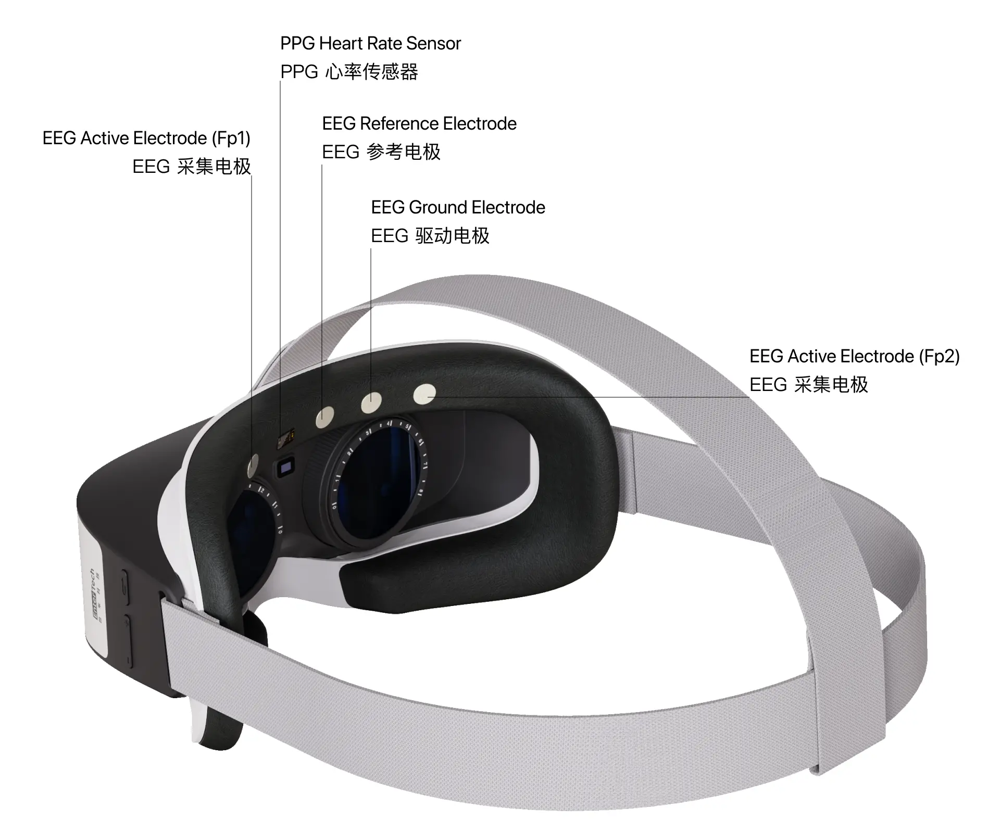

# 回车 VR 头显

## 硬件说明 {#hardware-instructions}

回车 VR 头显集成了双通道脑电和心率，配合 SDK，可以方便地在 VR 应用中集成各种脑电和心率的分析数据。

- 设备参数
  - 双通道脑电（EEG）采集
    - 采集电极位点：Fp1 / Fp2
    - 参考电极位点：Fpz
    - 采样率：250 Hz
    - 采样精度：24 位
  - PPG （光电容积脉搏波）心率监测
- 操作系统：Android 6.0 +
- 温度要求：0-40 ℃
- 蓝牙：BLE 5.0+

## 使用说明 {#operating-instructions}

### 配对连接 {#connecting}

脑电和心率传感器使用蓝牙和 VR 主机连接。使用集成我们 SDK 的应用，打开之后，应用会主动搜索并连接上我们的脑电和心率传感器。

:::tip

- 连接前请确保主机蓝牙已经打开。
- Android 主机连接前需要同意位置请求权限。
- 连接有一定概率会不成功，如果未成功，请再次尝试连接。
- 如果无法连接，请开关一次主机蓝牙，然后再重试。
- 如果还是无法连接，请重启app后再重试。

:::

### 佩戴 {#wearing}

- 请确保传感器和皮肤之间没有头发。
- 请放松面部肌肉和眼睛，过多的肌肉活动会干扰信号检测。
- 如果实时数据无法显示，请参考以下步骤检查佩戴情况：
  - 请他人帮忙检查传感器和皮肤之间是否有空隙。
  - 护肤品、化妆品和皮肤分泌的油脂可能影响数据检测和收集，必要时可用湿巾清洁皮肤，以提高信号质量。
  - 皮肤干燥或空气干燥也会影响信号检测，必要时可用湿巾滋润皮肤以提高信号质量。
  - 每次调整后，需要 30 秒至 1 分钟来稳定信号。

:::tip

- 佩戴时，VR 绑带不宜过松，前额金属电极需要紧贴皮肤以保证脑电信号质量。
- 皱眉、咬牙等肌肉电信号将会影响脑电波的信号质量。
- 使用过程中，头部不宜有大幅度的动作，动作过大会影响传感器与皮肤接触的稳定性，进而影响脑电波和心率的采集。

:::

### 清洁与保养 {#maintenance}

用湿纸巾擦拭前额电极，擦拭后需要及时用纸擦干或者晾干。

## 原始数据格式 {#raw-data-format}

回车 VR 头显包含双通道脑电（EEG）采集和 PPG 心率监测。如果希望获取设备采集到的原始信号，需要了解原始数据格式和解析方法，详情请参考：

- [双通道脑电波数据协议](../data/raw-data-protocol/eeg-data-protocol)
- [心率数据协议](../data/raw-data-protocol/hr-data-protocol)

## 数据分析服务 {#data-analysis-service}

如果你需要使用回车 VR 头显连接情感云或使用本地化数据分析 SDK 来获得相关数据分析服务，请参考下面列举的回车 VR 头显所支持的数据分析服务。

- 情感云数据分析服务详情请参考[情感云数据分析服务总览](../affective-cloud/data-analysis-service#data-analysis-service-overview)。
- 使用本地化数据分析服务请参考[本地化数据分析](../affective-cloud/develop-resources#local-data-analysis)。

| 服务类型 | 支持的数据分析服务 |
| ---- | ---- |
| 生物数据分析 | 双通道脑电波 |
|  | 心率 |
| 生理状态分析 | 注意力 |
|  | 放松度 |
|  | 压力水平 |
|  | 愉悦度 |
|  | 激活度 |
|  | 和谐度 |
|  | 睡眠 |
|  | 儿童注意力 |
|  | 儿童放松度 |

## 开发资源 {#develop-resources}

我们为不同平台的开发者提供了设备管理 SDK。你可以使用我们已经开发好的 SDK 快速接入，实现管理设备连接、数据采集等功能，并利用我们提供的 Demo 进行测试。

| 平台 | 资源 |
|---|---|
| iOS | [iOS 设备管理 SDK & Demo](https://github.com/Entertech/Enter-Biomodule-BLE-iOS-SDK) |
| Android | [Android 设备管理 SDK & Demo](https://github.com/Entertech/Enter-Biomodule-BLE-Android-SDK) |
| PC(Python) | [PC(Python) 设备管理 SDK & Demo](https://github.com/Entertech/Enter-Biomodule-BLE-PC-SDK) |