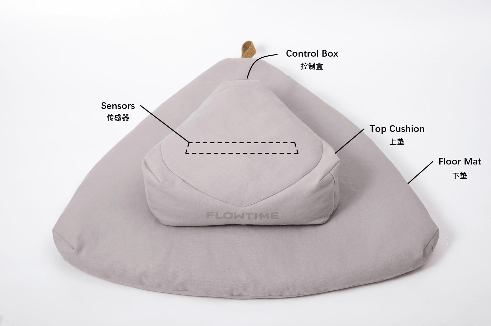
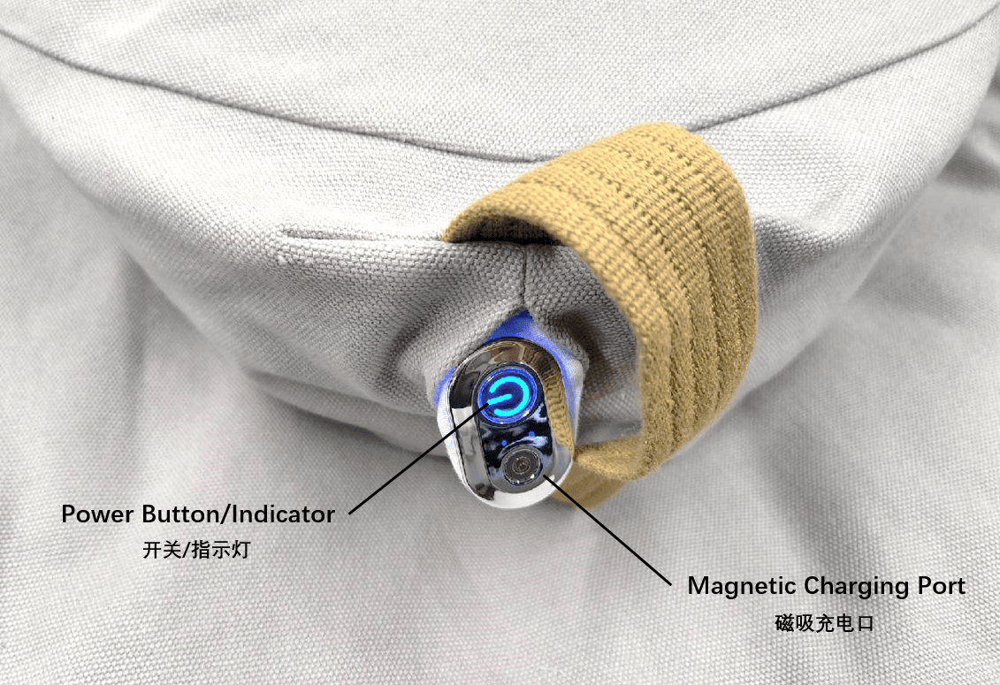

# Flowtime 坐垫

## 硬件说明 {#hardware-instructions}

Flowtime 坐垫内置了压电和压阻信号传感器，可在无感的情况下监测心率、呼吸等数据。前往[商城](./)可购买该设备。

- 设备参数
  - 压电信号采集
    - 采样率：125 Hz
    - 采样精度：12 位
  - 压阻信号采集
    - 采样率：25Hz
- 尺寸：
  - 上垫：41 * 40 * 13 cm
  - 下垫：76 * 79 * 7 cm
- 电池：900 mAh
- 充电电压：5V
- 操作系统：iOS 11.2 +/ Android 6.0 +
- 温度要求：0-40 ℃
- 蓝牙：BLE 5.0+

## 使用说明 {#operating-instructions}

### 连接 {#connecting}

- 在关机状态下有两种开机模式：
  - 正常使用模式，坐上垫子指示灯亮起，设备开机并进入广播状态，此时可以使用蓝牙主机设备搜索并连接设备。开机后设备会一直广播直到关机。
  - 第一次绑定设备，长按按键直至指示灯亮起，设备开机并进入广播状态，此时可以使用蓝牙主机设备搜索并连接设备。开机后设备会一直广播直到关机。
- 设备连接主机后指示灯将切换到长亮状态，此时可以通过指令控制设备进行采集等操作。
- 在已连接状态下，长按按键直至指示灯进入闪烁状态。设备会进入广播状态，可以使用另外的蓝牙主机设备搜索并连接设备。
- 设备和主机断开连接后即进入广播状态，此时可以使用蓝牙主机设备搜索并连接设备。

| 设备指示灯状态 | 设备状态 | 说明 |
|---|---|---|
| 闪烁 | 广播状态 | 主机可搜索并连接设备 |
| 长亮 | 连接状态 | 设备已和主机连接 |

:::info

因为指示灯比较耗电，所以状态指示灯会在 2 分钟后熄灭（充电过程中不会熄灭）。此时并不代表设备休眠或者关机。单击按键，指示灯会重新亮起。

:::

:::tip

- 连接前请确保主机蓝牙已经打开。
- Android 主机连接前需要同意位置请求权限。
- 如果周围有其他回车设备，连接时请远离它们。
- 连接有一定概率会不成功，如果未成功，请再次尝试连接
- 如果无法连接，请开关一次主机蓝牙，然后再重试。
- 如果还是无法连接，请重启主机后再重试。

:::

### 开关机 {#switch}

- 关机：长按设备按键直至灯完全熄灭。
- 开机：
  - 坐上垫子灯亮开机。
  - 长按直至灯亮即开机。

| 操作名称 | 操作及状态变化 |
|---|---|
| 开机 | 长按按键直至指示灯亮 |
|  | 坐上垫子灯亮开机 |
| 关机 | 长按按键直至指示灯完全熄灭 |

:::info

开机时，如果长按设备按键，仍旧没有灯亮，说明设备已经没电。此时先给设备充电，30 分钟后再尝试开机。

:::

### 电源指示灯 {#indicator}

通过指示灯可了解电源电量状态。

| 指示灯状态 | 设备状态 |
|---|---|
| 蓝灯 | 电量正常 |
| 红灯 | 电量低于 20%，电量不足 |
| 蓝灯呼吸灯 | 正在充电 |
| 灯灭 | 电量已充满 |

### 充电 {#charging}

- 通过磁吸数据线连接控制盒和电源适配器进行充电。电源适配器为 USB-A 口充电器，适配器无特殊要求，普通手机电源适配器即可。
- 红灯呼吸灯表示正在充电，但未充满。
- 充满电后会灯灭。
- 充电速度：充满电时间大约为 6 小时。
- 充电过程中控制盒会和主机断开连接。

### 坐下与坐姿 {#sitting}

#### 第一次使用

- 提起坐垫上垫，拍打并抖动几下，使内部荞麦壳恢复流动性
- 将上垫放于下垫上方
- 多次按压并晃动上垫，使荞麦壳把上垫的几个角填实
- 按照**每次坐下**进行使用

#### 每次坐下

- 轻轻拍打上垫，使表面平整
- 坐在上垫前部，双腿盘于下垫
- 轻轻晃动身体，让坐垫更贴合臀部和腿部
- 调整坐姿，使身体重心位于坐垫靠前的位置，并在体验过程中保持身体的稳定
- 过程中由于轻微动作可能导致短暂的信号质量不佳，保持稳定坐姿后可恢复正常
- 如果过程中频繁出现信号质量不佳，可能是传感器接触不良，此时参考**第一次使用**重新坐下

:::tip

- 由于内置的传感器对轻微动作较灵敏，为获得可靠的数据，请确保身体与传感器贴合良好，并保持稳定坐姿。未按说明使用可能导致信号质量不佳，影响使用。

:::

### 收纳于储存 {#storage}

- 使用结束后，关闭应用，设备会自动和手机断开连接并保持低功耗状态，不需要进行关机操作。此时硬件会进入广播状态，5分钟后设备自动关机。
- 若长时间不使用，可以选择将设备关机后再进行收纳。

### 清洁与保养 {#maintenance}

坐垫外套可以水洗，坐垫荞麦壳内胆可以将荞麦壳倒出后水洗。其他内胆不可拆卸、不可水洗。

## 原始数据格式 {#raw-data-format}

Flowtime 坐垫内置传感器包含压电信号和压阻信号的采集，从中可以提取脉搏波、呼吸等生物信号。我们将压电信号与压阻信号数据合并在同一个数据包中，命名为[压电压阻](./链接到情感云-数据说明-压电压阻)。如果想要获取设备采集到的原始数据，需要了解原始数据的数据格式，详情请参考：

- [压电压阻数据协议](../data/raw-data-protocol/pepr-data-protocol)

## 数据分析服务 {#data-analysis-service}

如果你需要使用 Flowtime 坐垫连接情感云或使用本地化数据分析 SDK 来获得相关数据分析服务，请参考下面列举的 Flowtime 坐垫所支持的数据分析服务。

- 情感云数据分析服务详情请参考[情感云数据分析服务总览](../affective-cloud/data-analysis-service#data-analysis-service-overview)。
- 使用本地化数据分析服务请参考[本地化数据分析](../affective-cloud/develop-resources#local-data-analysis)。

| 服务类型 | 支持的数据分析服务 |
| ---- | ---- |
| 生物数据分析 | 压电压阻 |
| 生理状态分析 | 压力水平 |
|  | 和谐度 |

## 开发资源 {#develop-resources}

我们为不同平台的开发者提供了设备管理 SDK。你可以使用我们已经开发好的 SDK 快速接入，实现管理设备连接、数据采集等功能，并利用我们提供的 Demo 进行测试。

| 平台 | 资源 |
|---|---|
| iOS | [iOS 设备管理 SDK & Demo](https://github.com/Entertech/Enter-Biomodule-BLE-iOS-SDK) |
| Android | [Android 设备管理 SDK & Demo](https://github.com/Entertech/Enter-Biomodule-BLE-Android-SDK) |
| PC(Python) | [PC(Python) 设备管理 SDK & Demo](https://github.com/Entertech/Enter-Biomodule-BLE-PC-SDK) |