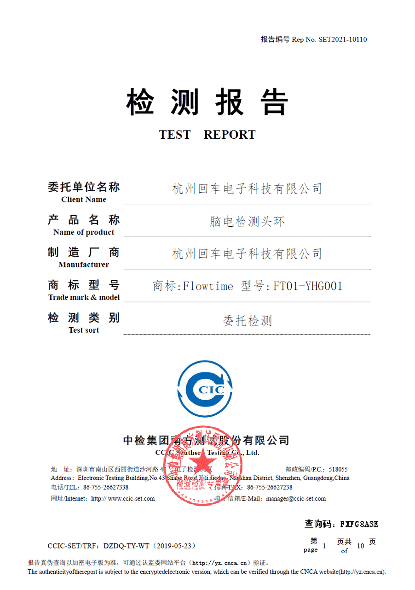
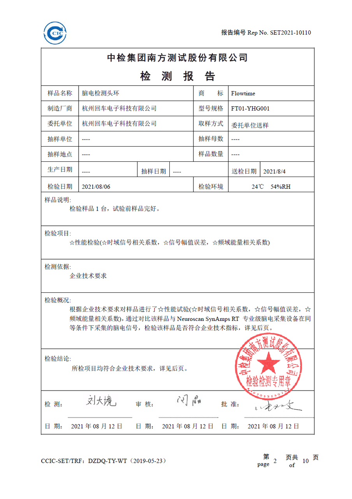
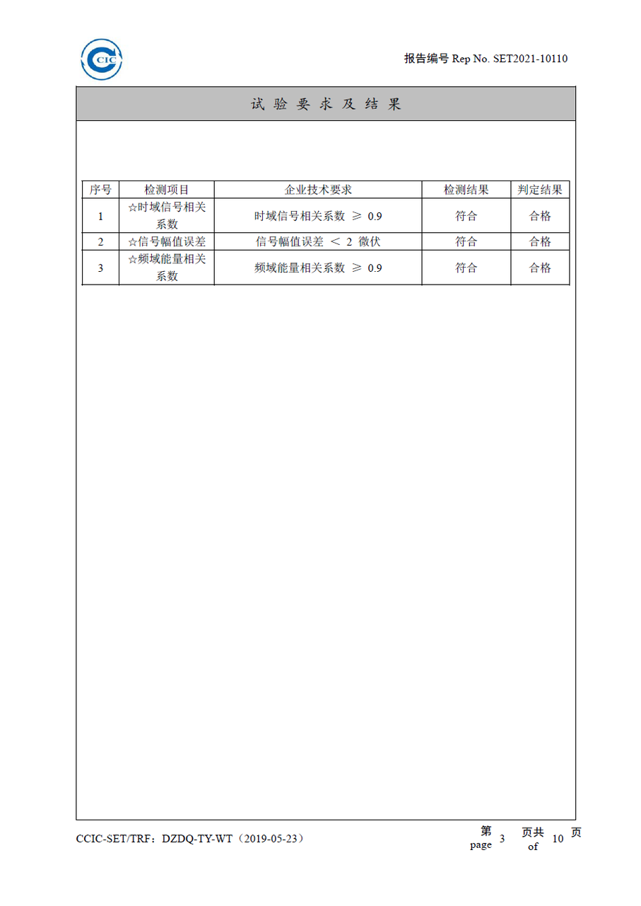

# 设备

我们为开发者提供了不同类型的设备，你可以根据需要购买相应的设备进行开发。

## 设备概览 {#devices-overview}

不同设备的原始信号采集功能以及可使用的数据分析服务如下。

| 设备 | 原始信号采集 | 生物数据分析服务 | 生理状态分析服务 |
| ---- | ------- | ------- | ------- |
| [Flowtime 头环](./devices/flowtime-headband) |  双通道 EEG 采集 PPG 心率监测 | 脑电波、脑电波节律能量 心率、HRV | 注意力、放松度、压力水平、和谐度、睡眠、愉悦度、激活度等 |
| [Flowtime 坐垫](./devices/flowtime-cushion) |  压电心率监测 压电呼吸监测 | 心率、脉搏波、HRV 呼吸率、呼吸波 | 压力水平、和谐度 |
| [回车 VR](./devices/entertech-vr-headset) |  双通道 EEG 采集 PPG 心率监测 | 脑电波、脑电波节律能量 心率、HRV | 注意力、放松度、压力水平、和谐度、睡眠、愉悦度、激活度等 |
| [热敷助眠眼罩](./devices/entertech-mask) |  单通道 EEG 采集 | 脑电波、脑电波节律能量 | 注意力、放松度、睡眠 |

## 开发资源 {#develop-resources}

我们为不同设备、不同平台的开发者提供了设备管理 SDK。你可以使用我们已经开发好的 SDK 快速接入，实现管理设备连接、数据采集等功能，并利用我们提供的 Demo 进行测试。点击对应设备的介绍，查看相关开发资源。

## 设备可靠性

我们委托第三方将我们的设备与专业脑电采集设备（Neuroscan SynAmps RT）进行了性能对比测试。如果你想了解我们的设备在脑电采集方面的可靠性，我们提供了由第三方出具的检测报告和详细的性能测试过程。

 |  | 
---|---|---

测试详情：

- [回车科技 Flowtime 和 Neuroscan SynAmps RT 硬件性能对比分析](https://entertech.feishu.cn/docs/doccnKZXOrc4sBP9uMI6RQbtIt3)
