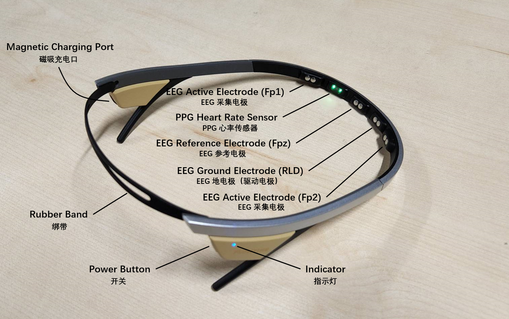
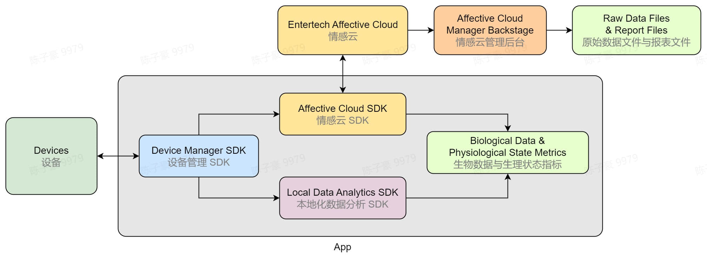
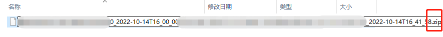
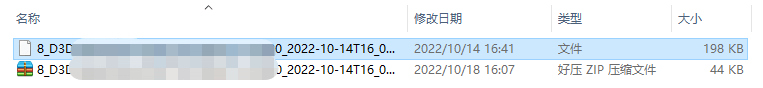
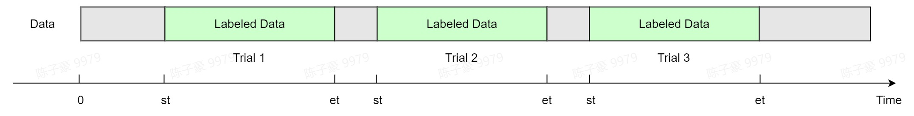

# Flowtime 头环

## 硬件说明

Flowtime 头环轻巧便携，佩戴简单，可用于在多种场景下采集前额脑电数据和心率数据。

在准备开发前，你可能需要了解的设备参数如下，如需了解更多详细参数请参考 [Flowtime 头环硬件说明](../../devices/flowtime-headband)。



- 设备参数
  - 双通道脑电（EEG）采集
    - 采集电极位点：Fp1 / Fp2
    - 参考电极位点：Fpz
    - 采样率：250 Hz
    - 采样精度：24 位
  - PPG （光电容积脉搏波）心率监测

## 数据分析服务

| 服务类型 | 支持的数据分析服务 |
| ---- | ---- |
| 生物数据分析 | 双通道脑电波 |
|  | 心率 |
| 生理状态分析 | 注意力 |
|  | 放松度 |
|  | 压力水平 |
|  | 愉悦度 |
|  | 激活度 |
|  | 和谐度 |
|  | 睡眠 |
|  | 儿童注意力 |
|  | 儿童放松度 |

## 使用数据采集软件

- 如果你只需对生物数据和生理状态数据进行离线分析，可以使用我们已经开发好的[心流实验 App](http://fir.entertech.cn/yujx)来采集数据，并通过情感云管理后台（链接）下载报表文件。在使用心流实验 App 采集数据时，你还可以结合自己的实验设计，为数据添加分段的标签记录，以便在离线分析时将不同实验任务或实验状态下的数据分割出来。
  - 心流实验 App 的详细使用说明请参考[心流实验 App 使用说明](https://entertech.feishu.cn/docx/Cc9MdR8GdoIrhdx1Unmc48G8nQd)。
  - 情感云管理后台的详细使用说明请参考[情感云管理后台使用说明](https://entertech.feishu.cn/docx/IJaYdP3JvoyWMLxhtzlcfN7rnwd)。
- 如果你具备一定的软件开发能力，你还可以利用我们提供的开发资源来开发自己的应用，从而实时获取生物数据和生理状态指标并进行分析。首先你需要使用 Flowtime 头环开发资源实现设备连接，然后你可以使用情感云开发资源来获得情感云数据分析服务。但如果你需要在没有网络环境的情况下获得数据分析服务，你可以选择使用本地化数据分析 SDK。
  - [Flowtime 头环开发资源](../../devices/flowtime-headband#develop-resources)
  - [情感云开发资源](../../affective-cloud/develop-resources)
  - [本地化数据分析 SDK](./)



## 连接设备

- 如果你使用心流实验 App 来采集数据，那么你可以根据[心流实验 App 使用说明](https://entertech.feishu.cn/docx/Cc9MdR8GdoIrhdx1Unmc48G8nQd)的操作来连接设备并采集数据。
- 如果你使用开发资源来采集数据，可参考下面的操作：
  - 长按按键直至指示灯亮起，设备开机并进入广播状态，此时可以在数据采集软件中搜索并连接设备。开机后设备会一直广播直到关机。
  - 设备连接主机后指示灯将切换到长亮状态，此时可以通过指令控制设备进行数据采集等操作。

:::tip

开机时，如果长按设备按键，仍旧没有灯亮，说明设备已经没电。此时先给设备充电，10 分钟后再尝试开机。充电教程请参考 [Flowtime 头环充电说明](../../devices/flowtime-headband#charging)。

因为指示灯比较耗电，所以状态指示灯会在 2 分钟后熄灭（充电过程中不会熄灭）。此时并不代表设备休眠或者关机。单击按键，指示灯会重新亮起。

:::

## 佩戴头环

- 从 3 种尺寸的绑带中，选择一条合适的，固定在头环尾部的凹槽中
- 固定好绑带之后，戴上头环，确保头环前侧的脑电波和心率传感器紧贴皮肤，以获得良好信号质量。如果大号的绑带无法保证头环稳定贴合皮肤，可以选择小一号的绑带
- 请确保传感器和皮肤之间没有头发

## 获取数据

- 使用 Flowtime 头环可获取的生物数据和生理状态指标请参考[数据分析服务总览](../../affective-cloud/data-analysis-service#data-analysis-service-overview)。
- 如果你使用我们提供的心流实验 App 并按照[心流实验 App 使用说明](https://entertech.feishu.cn/docx/Cc9MdR8GdoIrhdx1Unmc48G8nQd)来采集数据，那么你可以通过情感云管理后台下载报表文件，从中读取得到生物数据或生理状态指标。我们将在下文提供详细的操作步骤。
- 如果你使用我们提供的开发资源，并按照上面的步骤采集数据，那么你可以参考[使用本地化数据分析 SDK 获取生物数据和生理状态指标](../../data/get-data/get-biological-data-and-physiological-state-metrics#from-local-data-analysis-sdk)来进行操作。

### 报表文件下载

- 登录[情感云管理后台](http://admin.affectivecloud.cn)。
- 在**使用记录**中选择**生物数据分析服务**或**生理状态分析服务**，找到目标记录。
- 点击**操作**一列中的**下载报表文件**，可以得到压缩的报表文件，后缀名对应不同的生物数据分析或生理状态分析服务类型，如 .eeg.report 为双通道脑电波，.attention.report 为注意力。
- 更多情感云管理后台相关使用说明请参考[情感云管理后台使用说明](https://entertech.feishu.cn/docx/IJaYdP3JvoyWMLxhtzlcfN7rnwd)。

### 报表文件解压

- 情感云管理后台直接下载得到的原始数据文件是 gzip 压缩的，在读取之前需要先解压缩。
- 如果你的电脑中安装了 .zip 解压缩软件，你可以将下载的压缩原始数据文件后缀名更改为 .zip，并用解压缩软件直接解压，得到可以打开的文本文件。
- 如果你正在使用 Python，你也可以通过代码的方式来解压缩。




```python
import gzip
import json

with open(path, 'rb') as fr:  # path为压缩文件的路径
    content = fr.read()
    bin_data = gzip.decompress(content)
json_data = json.loads(bin_data)
with open(path + '_unz', 'w') as f:  # path+'_unz'为解压缩后的文件保存路径
    json.dump(json_data, f)
```

### 报表文件读取

- 解压缩后的文件可直接读取为 json，读取`data`字段中`report`字段保存的内容，即为十进制无符号 int 型原始数据。例如：`[0,0,119,7,236,...,136,214,58]`。
- 具体的报表文件格式可参考[报表文件格式](../../data/data-files-protocol/report-files)。
- 生物数据报表文件内容说明请参考[生物数据报表分析返回值](../../data/data-format/biological-data#biological-data-report-analysis-returns)。
- 生理状态报表文件内容说明请参考[生理状态报表分析返回值](../../data/data-format/physiological-state-metrics#physiological-state-report-analysis-returns)。
- 如果你正在使用 Python，你也可以直接利用下面的代码从解压后的文件中读取报表分析结果。

```python
import json

with open(path, 'r') as f:  # path为解压缩后的文件的路径
    content = json.load(f)
raw_data = content.get('data').get('raw')  # raw_data 即为十进制无符号 int 型原始数据
```

### 标签数据分割

- 如果你在实验过程中使用心流实验 App 为数据添加了分段标签记录，那么在离线分析时你可能需要从`report`中的某些全程记录数据里分割出添加标签的段落。例如注意力全程记录`attention_rec`。
- 首先根据`data`字段中`upload_cycle`字段显示的上传周期倍数，则`report`中的各项全程记录数据点之间的间隔时间为 $0.6 \times \operatorname{upload \_ cycle}$。例如`upload_cycle`为 3，则注意力全程记录`attention_rec`中每个数据点间隔时间为 $0.6 \times 3=1.8$ 秒。
- 从`label`字段中`rec`字段获得分段标签记录，并从每一段分段标签中读取开始时间`st`和结束时间`et`，具体数据结构参考[标签记录格式](../../data/data-files-protocol/label-rec-format)。
- 根据开始时间`st`和结束时间`et`，以及全程记录数据点的间隔时间，即可从全程记录中分割出标签段的数据。



## 关机

使用结束后，长按设备按键直至灯完全熄灭即可关机。

## 参考内容

- 关于 Flowtime 头环的详细说明请参考 [Flowtime 头环说明](../../devices/flowtime-headband)。
- 关于获取生物数据和生理状态指标的详细说明请参考[获取生物数据和生理状态指标](../../data/get-data/get-biological-data-and-physiological-state-metrics)。
- 关于情感云下载得到的报表文件格式请参考[报表文件格式](../../data/data-files-protocol/report-files)。
- 生物数据报表文件内容说明请参考[生物数据报表分析返回值](../../data/data-format/biological-data#biological-data-report-analysis-returns)。
- 生理状态报表文件内容说明请参考[生理状态报表分析返回值](../../data/data-format/physiological-state-metrics#physiological-state-report-analysis-returns)。

