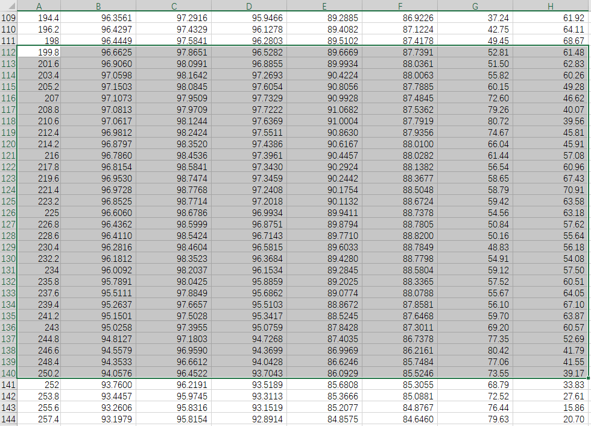
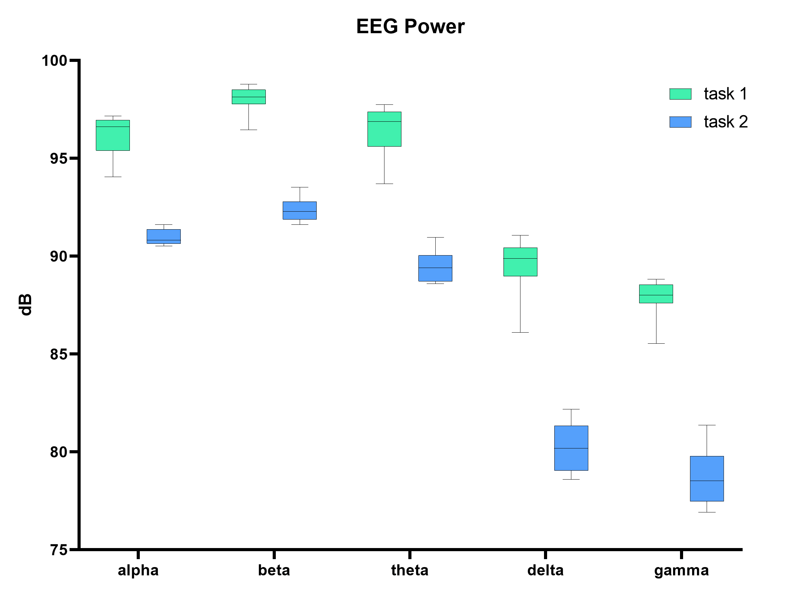

# 研究示例

我们提供了一个生物数据与生理状态指标的研究示例供你参考。在这个示例中，被试者进行两项任务，采集被试者的脑电波，分析两项任务过程中的脑电波节律能量以及注意力、放松度的平均值。
被试者进行的任务为：

- 任务一：CPT 任务，诱发专注状态
- 任务二：观看风景图，诱发放松状态

首先，按照上面的步骤使用心流实验 APP 采集数据，并在两项任务时添加相应的标签。从情感云后台下载报表文件，解析后得到以下数据：

- 脑电波 α/β/θ/δ/γ 频段能量变化曲线
  - eeg_alpha_curve
  - eeg_beta_curve
  - eeg_theta_curve
  - eeg_delta_curve
  - eeg_gamma_curve

- 注意力全程记录
  - attention_rec

- 放松度全程记录
  - relaxation_rec

我们将数据导入 Excel 软件来进行分析。根据报表文件`data`字段中`upload_cycle`字段显示的上传周期倍数，为数据添加时间轴。本示例中上传周期倍数为 3，即每个数据点时间间隔为 1.8 秒。

从`label`字段中`rec`字段获得两项实验任务的分段标签记录，并从每一段分段标签中读取开始时间`st`和结束时间`et`。根据开始时间st和结束时间et，从时间轴中找到对应的位置，即可从全程记录中分割出标签段的数据。本示例中两次任务的时间节点为：

- 任务一：st = 199.8, et = 250.2
- 任务二：st = 275.4, et = 325.8

任务一分段标签数据：

任务二分段标签数据：

对分段标签数据进行分析。本示例中分析两项实验任务中各个脑电波节律能量、注意力和放松度的数据分布，得到下面的箱型图：

 | 
---|---

从图中可以看出，进行任务一时，脑电波各节律能量更高，且注意力整体水平较高，放松度中等，而进行任务二时，脑电波各节律能量较低，注意力较低，放松度很高。