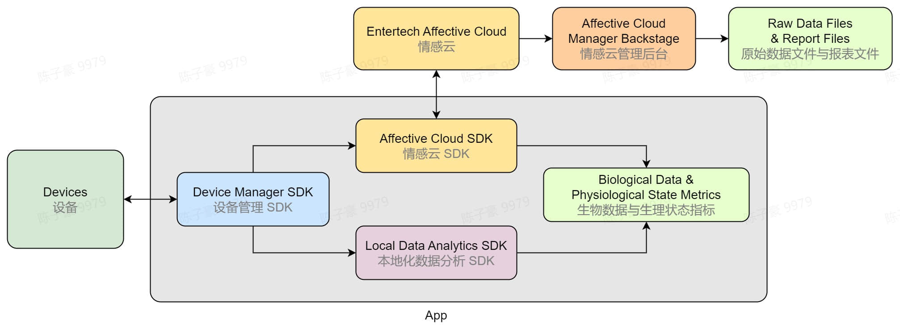

# 产品开发

:::tip

本教程适用于具有软件开发能力、希望利用生物数据与生理状态指标来开发产品的用户。

:::

- 通过本教程的引导，你可以快速学习如何使用设备，并使用我们提供的开发资源快速接入自己的应用，实时展示生物数据和生理状态指标，并在结束后获取报表分析。
- 你可以根据使用场景需要选择不同开发资源组合：
  - [设备管理 SDK](../devices#develop-resources)：连接设备并传输数据
  - [情感云 SDK](../affective-cloud/develop-resources#affective-cloud-sdk)：连接情感云，使用云端的数据分析服务，获取生物数据与生理状态指标
  - [本地化数据分析 SDK](./)：使用本地化数据分析服务，获取生物数据与生理状态指标
- 如果你使用情感云数据分析服务，你还可以通过[情感云管理后台](http://admin.affectivecloud.cn)进行数据查找、数据下载、数据统计等操作。

