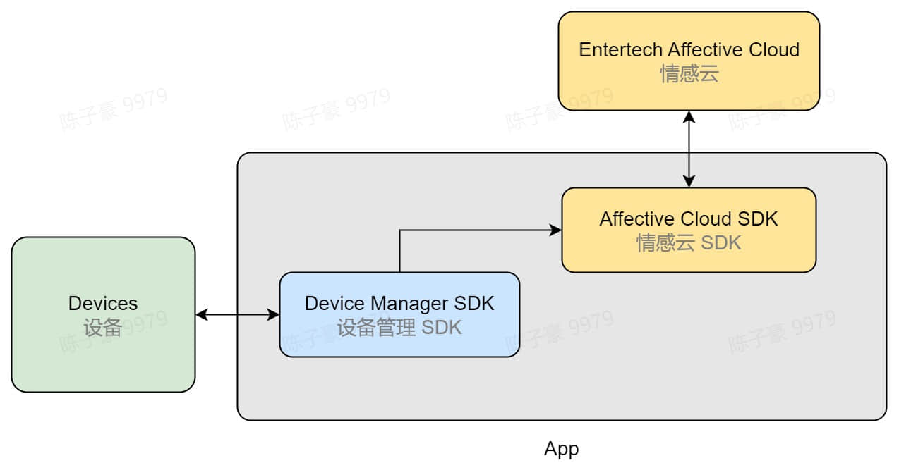

# 使用情感云数据分析服务

## 情感云数据分析

### 实时分析和报表分析

- 对于每一种数据分析服务，我们提供了两种形式的情感云返回的分析结果：实时分析和报表分析。
- 实时分析可以持续获得实时的生物数据和生理状态指标，让你的产品实时对用户的生理、情感状态做出响应，从而开发出与用户实时交互的产品。比如通过实时计算用户的注意力来控制小车的速度，或通过实时判断用户是否入睡来决定是否关闭助眠音乐等。
- 在经过一段时间的实时分析后可以选择进行报表分析。报表分析可以获得从会话开始到当前时刻的这段时间内的生物数据和生理状态指标趋势，让用户了解自己一段时间内的生理状态、情感情绪变化。比如通过睡眠曲线来反映用户的睡眠情况，或通过分析冥想用户的前后压力水平的变化来衡量冥想的减压效果等。

### 生物数据与生理状态指标

- 情感云根据不同设备上传的数据，可分析不同的生物数据（如脑电波、心率等）和生理状态指标（如注意力、睡眠和放松度等）。
- 分析数据需要订阅对应的数据分析服务，关于各项生物数据与生理状态指标的意义和说明请参考[数据说明](../../affective-cloud/data-interpretation)。
- 关于数据分析服务的依赖关系、分析结果等详细介绍请参考[数据分析服务](../../affective-cloud/data-analysis-service)。

### 开发资源

你可以根据产品需求，并参考数据分析服务内容和数据说明，选择需要的数据分析服务。使用[情感云开发资源](../../affective-cloud/develop-resources)连接情感云，获取相应的生物数据和生理状态指标。

## 情感云管理后台

- 登录情感云管理后台，可以进行数据查找、数据下载、数据统计、实验配置等操作。详细使用说明请参考[情感云管理后台使用说明](https://entertech.feishu.cn/docx/IJaYdP3JvoyWMLxhtzlcfN7rnwd)。
- 如果你需要获取原始信号进行离线分析，你可以通过情感云管理后台下载原始数据文件进行解析。详细操作请参考[使用情感云管理后台下载原始数据](../../data/get-data/get-raw-signals#from-affective-cloud-manager-backstage)。
- 如果你需要获取生物数据与生理状态指标进行离线分析，你可以通过情感云管理后台下载报表文件进行解析。详细操作请参考[使用情感云管理后台下载报表文件](../../data/get-data/get-biological-data-and-physiological-state-metrics#from-affective-cloud-manager-backstage)。