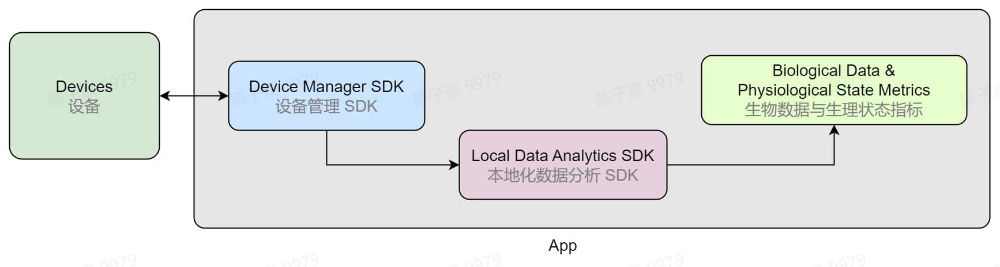

# 使用本地化数据分析服务

本地化数据分析 SDK 中集成了情感云的数据分析算法。使用本地化数据分析 SDK ，可以直接在本地对设备采集到的数据进行分析，实时获取生物数据和生理状态指标，在你的应用上进行展示，并在结束后获取报表分析结果。

- 关于数据分析服务的依赖关系、分析结果等详细介绍与情感云相似，请参考[平台能力](./链接到情感云-平台能力)。
- 关于各项生物数据与生理状态指标的意义和说明请参考[数据说明](./链接到情感云-数据说明)。
- 你可以根据产品需求，并参考数据分析服务内容和数据说明，选择需要的数据分析服务。使用[本地化数据分析 SDK](./)，获取相应的生物数据和生理状态指标。