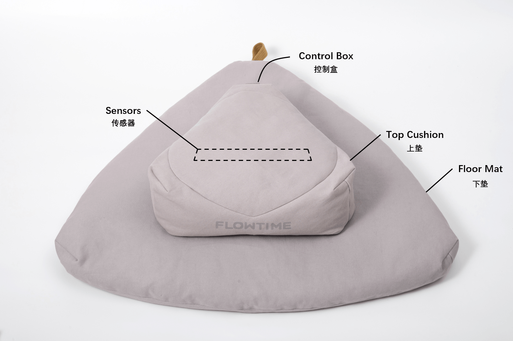

# Flowtime 坐垫

## 硬件说明

Flowtime 坐垫内置了压电和压阻信号传感器，其中压电信号可提取脉搏波、呼吸等生理特征，压阻信号可用于显示是否坐下。

- 设备参数
  - 压电信号采集
    - 采样率：125 Hz
    - 采样精度：12 位
  - 压阻信号采集
    - 采样率：25Hz

硬件说明中包含了设备的相关参数，使用说明中包含了设备的连接、开关机、坐姿等说明，开发资源中包含了设备的设备管理 SDK 和 Demo。

- [Flowtime 坐垫硬件说明](../../devices/flowtime-cushion#hardware-instructions)
- [Flowtime 坐垫使用说明](../../devices/flowtime-cushion#operating-instructions)
- [Flowtime 坐垫开发资源](../../devices/flowtime-cushion#develop-resources)

你可以参考使用说明学习如何使用设备，并利用开发资源快速接入自己的应用，连接设备并采集数据。

