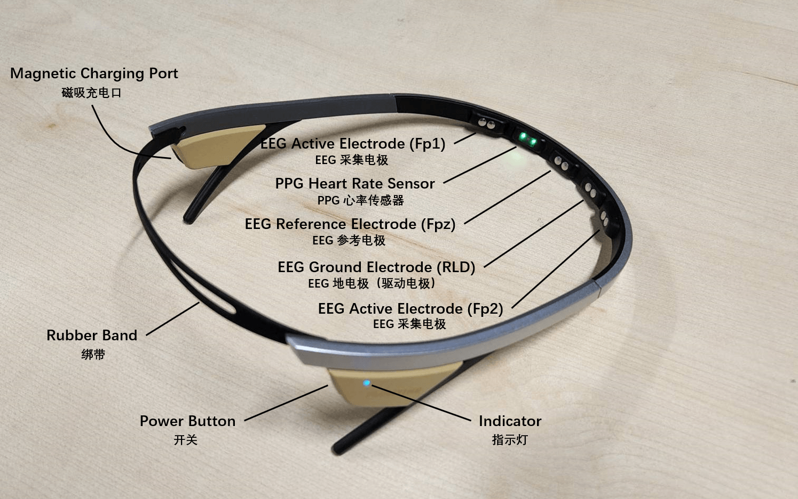
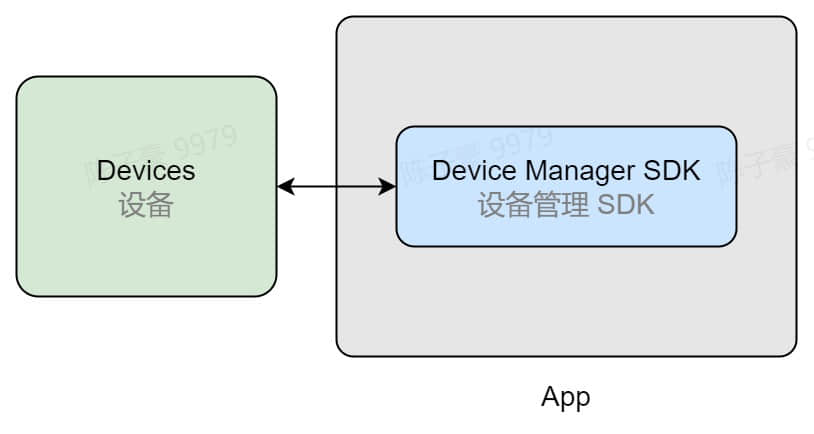

# Flowtime 头环

## 硬件说明

Flowtime 头环轻巧便携，佩戴简单，可用于在多种场景下采集前额脑电数据和心率数据。

- 设备参数
  - 双通道脑电（EEG）采集
    - 采集电极位点：Fp1 / Fp2
    - 参考电极位点：Fpz
    - 采样率：250 Hz
    - 采样精度：24 位
  - PPG （光电容积脉搏波）心率监测

硬件说明中包含了设备的相关参数，使用说明中包含了设备的连接、开关机、佩戴等说明，开发资源中包含了设备的设备管理 SDK 和 Demo。

- [Flowtime 头环硬件说明](../../devices/flowtime-headband#hardware-instructions)
- [Flowtime 头环使用说明](../../devices/flowtime-headband#operating-instructions)
- [Flowtime 头环开发资源](../../devices/flowtime-headband#develop-resources)

你可以参考使用说明学习如何使用设备，并利用开发资源快速接入自己的应用，连接设备并采集数据。

