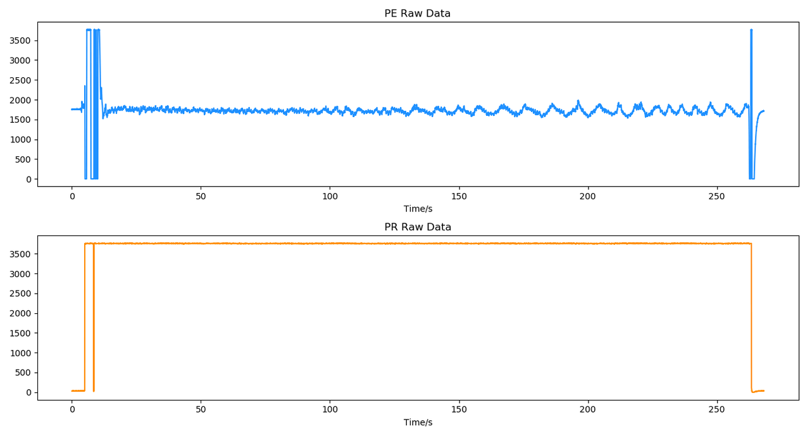

# Flowtime 坐垫

## 硬件说明

Flowtime 坐垫内置了压电和压阻信号传感器，其中压电信号可提取脉搏波、呼吸等生理特征，压阻信号可用于显示是否坐下。

在准备开发前，你可能需要了解的设备参数如下，如需了解更多详细参数请参考 [Flowtime 坐垫硬件说明](../../devices/flowtime-cushion#hardware-instructions)。


- 设备参数
  - 压电信号采集
    - 采样率：125 Hz
    - 采样精度：12 位
  - 压阻信号采集
    - 采样率：25Hz

## 使用数据采集软件

- 如果你只需对原始信号进行离线分析，可以使用我们已经开发好的[心流实验 App](http://fir.entertech.cn/yujx)来采集数据，并通过情感云管理后台（链接）下载原始数据文件。
  - 心流实验 App 的详细使用说明请参考[心流实验 App 使用说明](https://entertech.feishu.cn/docx/Cc9MdR8GdoIrhdx1Unmc48G8nQd)。
  - 情感云管理后台的详细使用说明请参考[情感云管理后台使用说明](https://entertech.feishu.cn/docx/IJaYdP3JvoyWMLxhtzlcfN7rnwd)。
- 如果你具备一定的软件开发能力，你还可以利用我们提供的开发资源来开发自己的应用，从而实时获取原始信号并进行分析。
  - [Flowtime 坐垫开发资源](../../devices/flowtime-cushion#develop-resources)

## 连接设备

- 如果你使用心流实验 App 来采集数据，那么你可以根据[心流实验 App 使用说明](https://entertech.feishu.cn/docx/Cc9MdR8GdoIrhdx1Unmc48G8nQd)的操作来连接设备并采集数据。
- 如果你使用开发资源来采集数据，可参考下面的操作：
  - 第一次绑定设备，长按按键直至指示灯亮起，设备开机并进入广播状态，此时可以在数据采集软件中搜索并连接设备。开机后设备会一直广播直到关机。
  - 之后每次使用无需长按按键，直接坐上垫子指示灯即会亮起，设备开机并进入广播状态。
  - 设备连接主机后指示灯将切换到长亮状态，此时可以通过指令控制设备进行数据采集等操作。

:::tip

开机时，如果长按设备按键，仍旧没有灯亮，说明设备已经没电。此时先给设备充电，10 分钟后再尝试开机。充电教程请参考 [Flowtime 坐垫充电说明](../../devices/flowtime-cushion#charging)。

因为指示灯比较耗电，所以状态指示灯会在 2 分钟后熄灭（充电过程中不会熄灭）。此时并不代表设备休眠或者关机。单击按键，指示灯会重新亮起。

:::

## 坐下与坐姿

由于压电信号传感器对压力的细微变化十分灵敏，为保证采集到信号质量良好的数据，请参考以下说明使用 Flowtime 坐垫。

### 第一次使用

- 提起坐垫上垫，拍打并抖动几下，使内部荞麦壳恢复流动性。
- 将上垫放于下垫上方。
- 多次按压并晃动上垫，使荞麦壳把上垫的几个角填实。
- 按照**每次坐下**进行使用。

### 每次坐下

- 轻轻拍打上垫，使表面平整。
- 坐在上垫前部，双腿盘于下垫。
- 轻轻晃动身体，让坐垫更贴合臀部和腿部。
- 调整坐姿，使身体重心位于坐垫靠前的位置，并在体验过程中保持身体的稳定。
- 过程中由于轻微动作可能导致短暂的信号质量不佳，保持稳定坐姿后可恢复正常。
- 如果过程中频繁出现信号质量不佳，可能是传感器接触不良，此时参考**第一次使用**重新坐下。

## 获取原始信号

- 使用 Flowtime 坐垫可采集压电压阻（pepr）数据，压电信号可用于提取脉搏波和呼吸特征，压阻信号可用于判断是否坐下。
- 如果你使用我们提供的心流实验 App 并按照[心流实验 App 使用说明](https://entertech.feishu.cn/docx/Cc9MdR8GdoIrhdx1Unmc48G8nQd)来采集数据，那么你可以通过情感云管理后台下载原始数据文件，从中读取并解析得到原始信号。我们将在下文提供详细的操作步骤。
- 如果你使用我们提供的设备管理 SDK 来开发应用，并按照上面的步骤采集数据，那么你可以参考[使用设备管理 SDK 获取原始信号](../../data/get-data/get-raw-signals#from-device-manager-sdk)来进行操作。

### 原始数据文件下载

- 登录[情感云管理后台](http://admin.affectivecloud.cn)。
- 在**使用记录**中选择**生物数据分析服务**，找到目标记录。
- 点击**操作**一列中的**下载原始数据**，可以得到压缩的原始数据文件，后缀名 .pepr。


### 原始数据文件解压

- 情感云管理后台直接下载得到的原始数据文件是 gzip 压缩的，在读取之前需要先解压缩。
- 如果你的电脑中安装了 .zip 解压缩软件，你可以将下载的压缩原始数据文件后缀名更改为 .zip，并用解压缩软件直接解压，得到可以打开的文本文件。
- 如果你正在使用 Python，你也可以通过代码的方式来解压缩。

```python
import gzip
import json

with open(path, 'rb') as fr:  # path为压缩文件的路径
    content = fr.read()
    bin_data = gzip.decompress(content)
json_data = json.loads(bin_data)
with open(path + '_unz', 'w') as f:  # path+'_unz'为解压缩后的文件保存路径
    json.dump(json_data, f)
```

### 原始数据文件读取

- 解压缩后的文件可直接读取为 json，读取`data`字段中`raw`字段保存的数组，即为十进制无符号 int 型原始数据。例如：`[0,0,119,7,236,...,136,214,58]`。
- 具体的原始数据文件格式可参考[原始数据文件协议](../../data/data-files-protocol/raw-data-files)。
- 如果你正在使用 Python，你也可以直接利用下面的代码从解压后的文件中读取十进制无符号 int 型原始数据。

```python
import json

with open(path, 'r') as f:  # path为解压缩后的文件的路径
    content = json.load(f)
raw_data = content.get('data').get('raw')  # raw_data 即为十进制无符号 int 型原始数据
```

### 原始信号解析

- 从原始数据文件中读取得到的十进制无符号 int 型原始数据是当次会话中所有数据包拼接而成的，因此需要先按照不同数据类型的数据包长度拆分成独立的数据包。
- 拆分后得到的独立数据包根据[压电压阻数据协议](../../data/raw-data-protocol/pepr-data-protocol)解析可得到每个数据包的原始信号。
- 将每个数据包解析得到的原始信号拼接，可得到当次会话完整的原始信号。
- 如果你正在使用 Python，你也可以直接利用下面的代码获得解析后的原始信号。

#### 压电压阻数据解析

```python
# 拆分成独立数据包
pkg_list = [raw_data[i:i+15] for i in range(0, len(raw_data), 15)]  # raw_data 为十进制无符号 int 型原始数据
# 初始化
pe_data = []  # 解析后压电原始信号
pr_data = []  # 解析后压阻原始信号
# 解析
for pkg in pkg_list:
    for j in range(5):
        pe_point = pkg[j*2+2]*2**8 + pkg[j*2+3]
        pe_data.append(pe_point)
    pr_point = pkg[12]*2**8 + pkg[13]
    pr_data.append(pr_point)
```

典型的压电压阻原始信号如下图，由于压电传感器对压力变化十分灵敏，通过压电信号可以反映人体的脉搏波、呼吸等特征，而压阻信号可以反映人体与传感器之间的压力，可用于显示人体与传感器之间是否接触良好。



## 参考内容

- 关于 Flowtime 坐垫的详细说明请参考 [Flowtime 坐垫说明](../../devices/flowtime-cushion)。
- 关于获取原始信号的详细说明请参考[获取原始信号](../../data/get-data/get-raw-signals)。
- 关于原始信号解析方法的详细说明请参考[原始数据协议](../../data/raw-data-protocol)。
- 关于情感云下载得到的原始数据文件格式请参考[原始数据文件协议](../../data/data-files-protocol/raw-data-files)。
