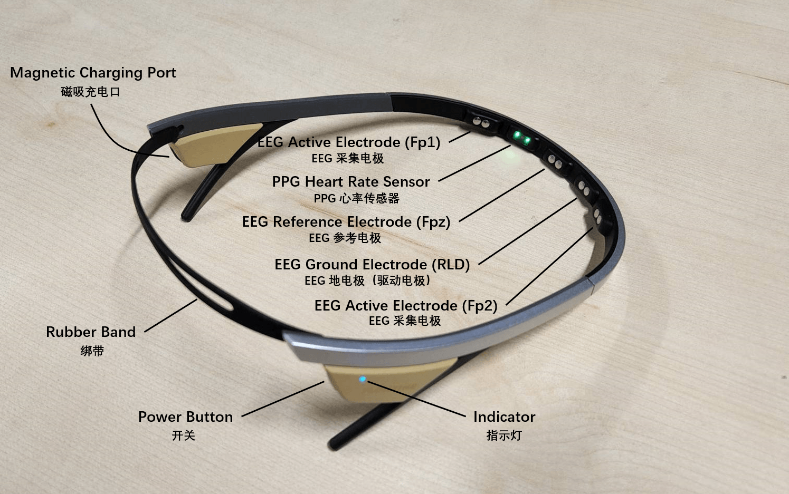
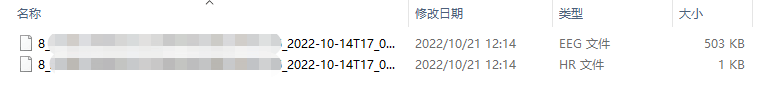

# Flowtime 头环

## 硬件说明

Flowtime 头环轻巧便携，佩戴简单，可用于在多种场景下采集前额脑电数据和心率数据。

在准备开发前，你可能需要了解的设备参数如下，如需了解更多详细参数请参考 [Flowtime 头环硬件说明](./链接到设备-Flowtime头环硬件说明)。



- 设备参数
  - 双通道脑电（EEG）采集
    - 采集电极位点：Fp1 / Fp2
    - 参考电极位点：Fpz
    - 采样率：250 Hz
    - 采样精度：24 位
  - PPG （光电容积脉搏波）心率监测

## 使用数据采集软件

- 如果你只需对原始信号进行离线分析，可以使用我们已经开发好的[心流实验 App](./)来采集数据，并通过情感云管理后台（链接）下载原始数据文件。
  - 心流实验 App 的详细使用说明请参考[心流实验 App 使用说明](./)。
  - 情感云管理后台的详细使用说明请参考[情感云管理后台使用说明](./)。
- 如果你具备一定的软件开发能力，你还可以利用我们提供的开发资源来开发自己的应用，从而实时获取原始信号并进行分析。
  -  [Flowtime 头环开发资源](./链接到设备-Flowtime头环开发资源)

## 连接设备

- 如果你使用心流实验 App 来采集数据，那么你可以根据[心流实验 App 使用说明](./)的操作来连接设备并采集数据。
- 如果你使用开发资源来采集数据，可参考下面的操作：
  - 长按按键直至指示灯亮起，设备开机并进入广播状态，此时可以在数据采集软件中搜索并连接设备。开机后设备会一直广播直到关机。
  - 设备连接主机后指示灯将切换到长亮状态，此时可以通过指令控制设备进行数据采集等操作。

:::tip

开机时，如果长按设备按键，仍旧没有灯亮，说明设备已经没电。此时先给设备充电，10 分钟后再尝试开机。充电教程请参考 [Flowtime 头环充电说明](./链接到设备-Flowtime头环使用说明-充电)。

因为指示灯比较耗电，所以状态指示灯会在 2 分钟后熄灭（充电过程中不会熄灭）。此时并不代表设备休眠或者关机。单击按键，指示灯会重新亮起。

:::

## 佩戴头环

- 从 3 种尺寸的绑带中，选择一条合适的，固定在头环尾部的凹槽中
- 固定好绑带之后，戴上头环，确保头环前侧的脑电波和心率传感器紧贴皮肤，以获得良好信号质量。如果大号的绑带无法保证头环稳定贴合皮肤，可以选择小一号的绑带
- 请确保传感器和皮肤之间没有头发

## 获取原始信号

- 使用 Flowtime 头环可采集双通道脑电波（eeg）和心率（hr）数据。
- 如果你使用我们提供的心流实验 App 并按照[心流实验 App 使用说明](./)来采集数据，那么你可以通过情感云管理后台下载原始数据文件，从中读取并解析得到原始信号。我们将在下文提供详细的操作步骤。
- 如果你使用我们提供的设备管理 SDK 来开发应用，并按照上面的步骤采集数据，那么你可以参考[使用设备管理 SDK 获取原始信号](./链接到数据-使用设备管理SDK获取原始信号)来进行操作。

### 原始数据文件下载

- 登录[情感云管理后台](./)。
- 在**使用记录**中选择**生物数据分析服务**，找到目标记录。
- 点击**操作**一列中的**下载原始数据**，可以得到压缩的原始数据文件，后缀名 .eeg 为双通道脑电波，.hr 为心率。



### 原始数据文件解压

- 情感云管理后台直接下载得到的原始数据文件是 gzip 压缩的，在读取之前需要先解压缩。
- 如果你的电脑中安装了 .zip 解压缩软件，你可以将下载的压缩原始数据文件后缀名更改为 .zip，并用解压缩软件直接解压，得到可以打开的文本文件。
- 如果你正在使用 Python，你也可以通过代码的方式来解压缩。

```python
import gzip
import json

with open(path, 'rb') as fr:  # path为压缩文件的路径
    content = fr.read()
    bin_data = gzip.decompress(content)
json_data = json.loads(bin_data)
with open(path + '_unz', 'w') as f:  # path+'_unz'为解压缩后的文件保存路径
    json.dump(json_data, f)
```

### 原始数据文件读取

- 解压缩后的文件可直接读取为 json，读取`data`字段中`raw`字段保存的数组，即为十进制无符号 int 型原始数据。例如：`[0,0,119,7,236,...,136,214,58]`。
- 具体的原始数据文件格式可参考[数据文件格式](./)。
- 如果你正在使用 Python，你也可以直接利用下面的代码从解压后的文件中读取十进制无符号 int 型原始数据。

```python
import json

with open(path, 'r') as f:  # path为解压缩后的文件的路径
    content = json.load(f)
raw_data = content.get('data').get('raw')  # raw_data 即为十进制无符号 int 型原始数据
```

### 原始信号解析

- 从原始数据文件中读取得到的十进制无符号 int 型原始数据是当次会话中所有数据包拼接而成的，因此需要先按照不同数据类型的数据包长度拆分成独立的数据包。
- 拆分后得到的独立数据包根据[原始数据协议](./)解析可得到每个数据包的原始信号。
- 将每个数据包解析得到的原始信号拼接，可得到当次会话完整的原始信号。
- 如果你正在使用 Python，你也可以直接利用下面的代码获得解析后的原始信号。

#### 双通道脑电波数据解析

```python
# 拆分成独立数据包
pkg_list = [raw_data[i:i+20] for i in range(0, len(raw_data), 20)]  # raw_data 为十进制无符号 int 型原始数据
# 初始化
eegl_data = []  # 解析后左通道脑电波原始信号
eegr_data = []  # 解析后右通道脑电波原始信号
# 解析
for pkg in pkg_list:
    for j in range(3):
        eegl_point = pkg[j*6+2]*2**16 + pkg[j*6+3]*2**8 + pkg[j*6+4]
        eegr_point = pkg[j*6+5]*2**16 + pkg[j*6+6]*2**8 + pkg[j*6+7]
        eegl_data.append(eegl_point)
        eegr_data.append(eegr_point)

# 如果你需要计算实际的脑电波电压幅值，则需要经过下面的处理
eegl_voltage = [d*4.8*10**6/2**24/12 for d in eegl_data]  # 左通道脑电波电压
eegr_voltage = [d*4.8*10**6/2**24/12 for d in eegr_data]  # 右通道脑电波电压
```

典型的双通道脑电波原始信号如下图，由于原始脑电波中存在较大的漂移电压，而脑电波电压幅值非常小（微伏级），因此很难通过肉眼从原始脑电波数据图中看出脑电波特征，将其局部放大或经过滤除漂移等处理后，可见细微的波形特征。


:::tip
脑电波原始信号中可能偶尔出现一个离群点，是数据传输丢失导致的，对于这种情况可手动将该离群点剔除。
:::

#### 心率数据解析

```python
# 对于心率数据，十进制无符号 int 型原始数据即为心率原始信号
hr_data = raw_data  # raw_data 为十进制无符号 int 型原始数据
```

典型的心率原始信号如下图。


## 关机

使用结束后，长按设备按键直至灯完全熄灭即可关机。

## 其他信息

- 关于 Flowtime 头环的详细说明请参考 [Flowtime 头环说明](./链接到设备-Flowtime头环)。
- 关于获取原始信号的详细说明请参考[获取原始信号](./链接到数据-获取原始信号)。
- 关于原始信号解析方法的详细说明请参考[原始数据协议](./)。
- 关于情感云下载得到的原始数据文件格式请参考[数据文件格式](./)。
