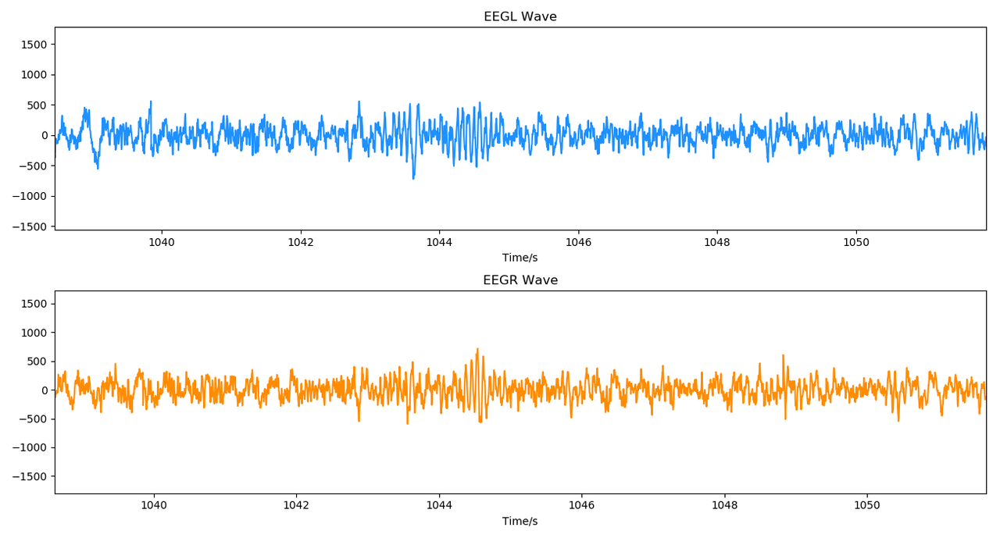
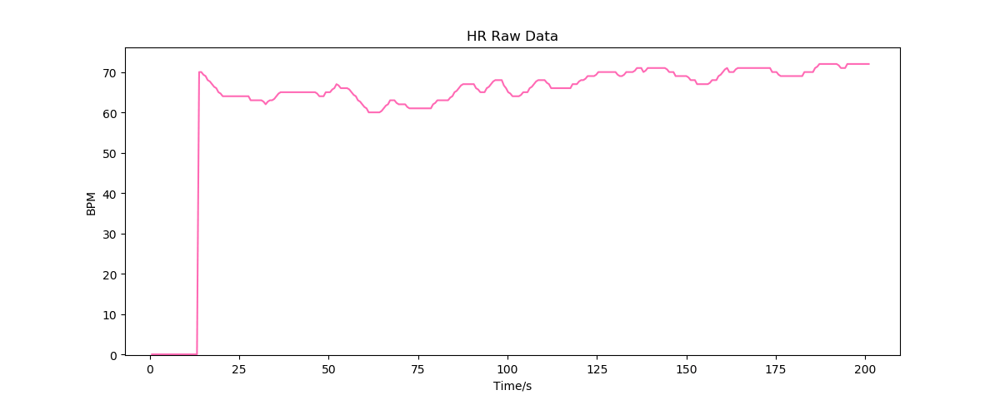
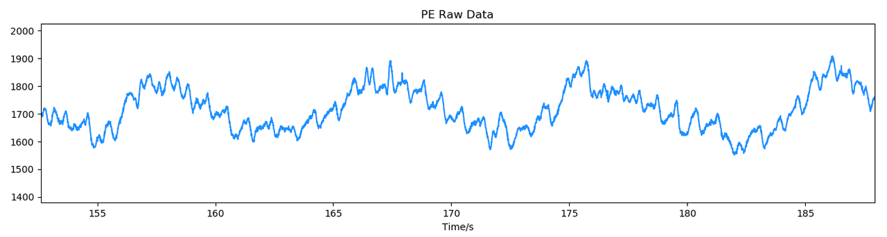

# 原始信号研究

:::tip

- 适用于生物医学工程等研究背景或具备信号处理算法研发能力、希望获取原始信号来进行研究的用户。
- 原始信号是指使用设备采集到的原始信号，包括脑电波原始信号、心率数据、压电信号等。
- 要进行原始信号研究，你需要熟悉 MATLAB、Python 等常用工程软件，了解常见的数据类型、数据结构等程序基础知识，并掌握数字滤波、傅里叶变换等常用信号处理手段。

:::

- 通过本教程的引导，你可以快速学习如何使用 FLOWTIME 设备，并获取设备采集到的原始信号。
- 在获取到原始信号后，你可以通过 MATLAB、Python 等工具对原始信号进行分析。
- 按照本教程，你可以获得类似下面的原始信号。

### 双通道脑电波

### 心率

### 压电信号

