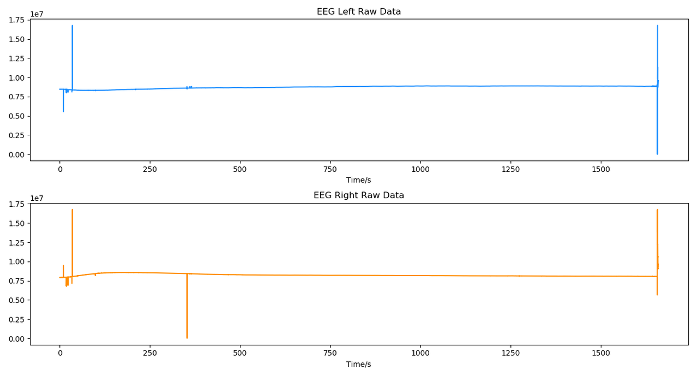
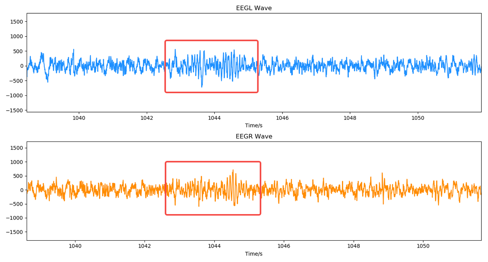
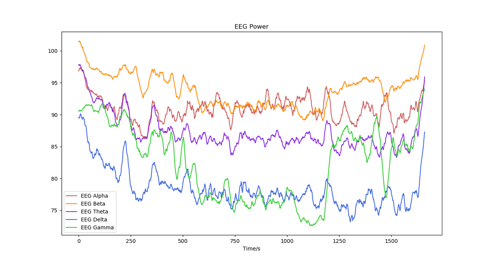

# 双通道脑电波原始信号研究示例

从脑电波数据中提取一些时域和频域特征，可以反映大脑状态的变化。

在睡眠监测中，采集并解析得到如下的双通道脑电波原始信号。

由于脑电波原始信号中有较大的漂移电压，因此需要进行漂移滤除。你可以使用一个截止频率为 0.5Hz 的高通数字滤波器来实现漂移滤除。

另外，由于环境中的电器设备等干扰，脑电波原始信号中可能含有一些工频噪声，可通过一个工频陷波器来滤除工频干扰。

在睡眠监测中，我们主要关注的脑电波频段在 0.5-40Hz，因此可通过一个带通滤波器得到这个频段的脑电波形。

经过上面这些基础信号处理，可以得到如下的双通道脑电波形。其中可见明显的特征波形（睡眠纺锤波）。

利用 FFT 计算脑电波频谱，还可以得到 α 波、β 波、θ 波、δ 波、γ 波等典型脑电节律的能量变化趋势，从而反映睡眠状态的变化。

