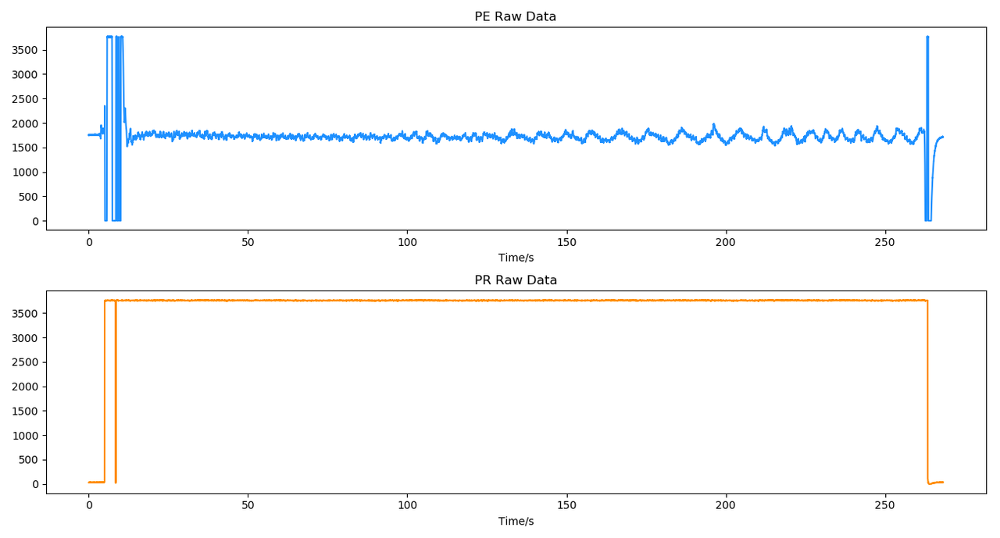
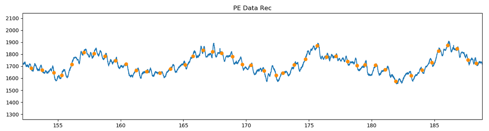
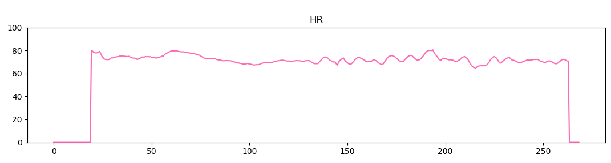
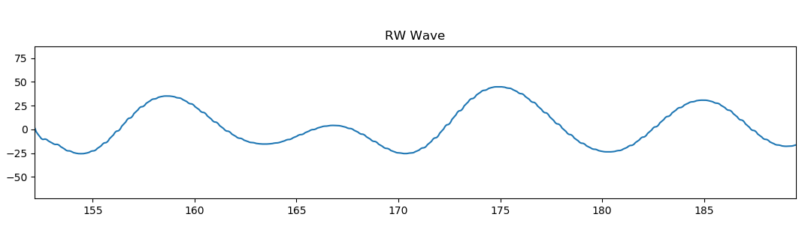
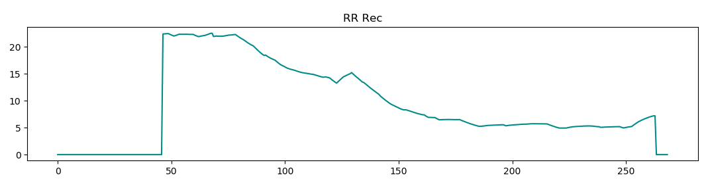

# 压电压阻原始信号研究示例

Flowtime 坐垫的压电信号可提取脉搏波、呼吸特征，压阻信号可以反映用户是否坐下。

在呼吸训练中，采集并解析得到如下的压电压阻原始信号。

通过压阻数据可以明显区分用户的坐下状态，高电平表示坐下，低电平表示未坐下，因此在分析压电信号时，可以将未坐下的数据剔除。

对于压电信号，利用不同参数的带通滤波器可以分别提取出脉搏波、呼吸波成分。

通过算法可定位脉搏波位置。

进而可以计算全程的心率变化曲线。

从压电信号中可以提取出如下的呼吸波。

进而可以计算全程的呼吸率变化曲线。

