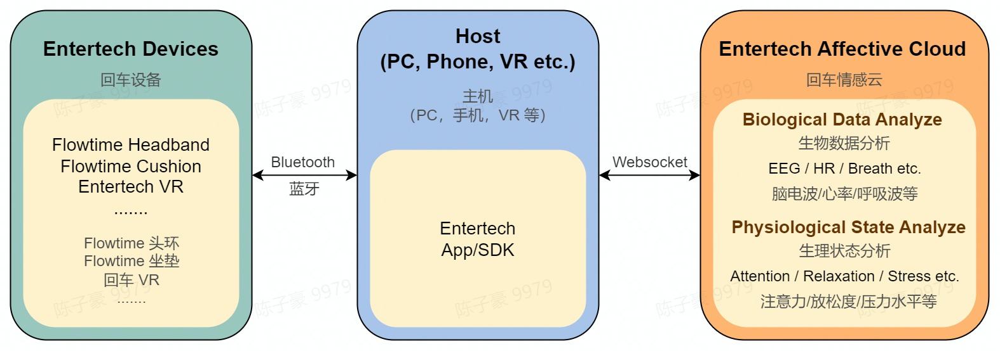

# 开始

欢迎来到回车开发者文档！在这里，你可以了解如何使用回车设备进行数据采集或应用开发。

## 架构

主机（PC、手机、VR 等）通过设备管理 SDK 与回车设备连接，控制其采集脑电波、心率、脉搏波等生物信号。在 APP 中集成情感云 SDK，将设备采集到的原始信号上传至情感云，情感云将返回分析后的生物数据与生理状态指标。

## 设备

不同设备的原始信号采集功能以及可使用的数据分析服务如下。关于数据分析结果的具体内容请参考[情感云数据分析服务总览](/链接到情感云-情感云数据分析服务总览)。

| 设备 | 原始信号采集 | 生物数据分析服务 | 生理状态分析服务 |
| ---- | ------- | ------- | ------- |
| [Flowtime 头环](/链接到设备-Flowtime头环) |  双通道 EEG 采集 PPG 心率监测 | 脑电波、脑电波节律能量 心率、HRV | 注意力、放松度、压力水平、和谐度、睡眠、愉悦度、激活度等 |
| [Flowtime 坐垫](/链接到设备-Flowtime坐垫) |  压电心率监测 压电呼吸监测 | 心率、脉搏波、HRV 呼吸率、呼吸波 | 压力水平、和谐度 |

## 开发资源

## 工具

### 心流实验 App

你可以使用[心流实验 App](/下载) 来达到以下目的：

- 数据体验：连接设备和情感云平台，实时观测生物数据和生理状态指标，并获取报表分析。
- 实验研究：采集原始信号数据或情感云分析得到的生物数据与生理状态指标，并为不同实验范式下的数据添加分段标签，进行离线分析和研究。

详情请参考[心流实验 App 使用说明](/)。

### 情感云管理后台

通过情感云管理后台，你可以进行数据查找、数据下载、数据统计、实验配置等操作。

详情请参考[情感云管理后台使用说明](/)。

## 数据获取

我们提供了原始信号、生物数据和生理状态指标的多种获取途径。

- 原始信号
  - 使用设备管理 SDK 连接设备采集原始数据并解析。
  - 使用心流实验 APP 连接设备采集信号，从情感云管理后台下载原始数据并解析。
- 生物数据和生理状态指标
  - 使用设备管理 SDK 连接设备采集信号，并通过情感云 SDK 连接情感云获取数据分析服务。
  - 使用设备管理 SDK 连接设备采集信号，并使用本地数据分析 SDK 获取数据分析服务。
  - 使用心流实验 APP 连接设备采集数据，从情感云管理后台下载报表数据并解析。

## 开发指南

如果你已经购买了回车设备，你可以根据自己的开发需求选择相应的[开发指南](/)，实现快速开发。